# AI Image Recognition 项目面试完整说明

## 使用说明

这份文档是本项目的面试准备材料。它不是简单的 README，也不是只介绍“如何启动项目”的操作手册，而是要帮助项目负责人完整回答下面几类问题：这个项目解决了什么问题，为什么这样设计，数据从哪里来，模型如何训练和推理，分类与检测有什么区别，前后端如何协作，代码为什么要这样组织，遇到异常如何处理，当前方案有什么不足，下一步如何工程化。

面试时不需要把整份文档逐字背诵。建议先记住项目主线，再根据面试官的问题展开。项目主线可以概括为：

```text
用户上传图片
    -> Flask 接收请求
    -> 根据模式选择分类或检测
    -> 预处理图片
    -> 调用已经准备好的模型权重
    -> 将模型输出转换成稳定的数据结构
    -> 返回 JSON 和图片 URL
    -> 前端展示 Top-3、检测框和置信度
```

这个项目同时包含两个视觉任务。第六课完成的是图像分类：整张图片回答“这张图最像哪个类别”。第七课增加的是目标检测：回答“图片里有哪些目标、每个目标在哪里、模型有多确定”。两项能力共用同一个 Web 页面，但底层模型、输出形式和评价方法不同。

### 文档阅读地图

这份材料可以按照面试官追问的方向阅读，而不必从头背到尾：

| 面试官关注方向 | 重点章节 | 应当给出的证据 |
| --- | --- | --- |
| 产品与业务价值 | 第一、二、十一章 | 可操作 Web 页面、分类与检测双工作流 |
| 数据与模型 | 第四、五、六章 | 37 类映射、checkpoint、90.19% 验证准确率 |
| 后端工程 | 第八、九、十四章 | API、异常分级、模型缓存、上传清理 |
| 面向对象设计 | 第十章 | 抽象接口、具体实现、值对象、职责拆分 |
| 测试与质量 | 第十三章 | 9 项自动化测试、真实接口和浏览器回归 |
| 系统设计与扩展 | 第十四、十五章 | 当前边界、生产部署方案、模型演进路线 |
| 项目表达 | 第十六至十八章 | 高频问答、30 秒/2 分钟/5 分钟脚本、简历描述 |

### 当前可验证基线

面试陈述必须以实际代码和测试结果为准。当前版本可验证的基线如下：

- 分类架构：MobileNetV3-Large，输出 37 个 Oxford-IIIT Pet 品种。
- 分类权重：`models/oxford_pet_mobilenet_epoch1.pth`，推理时离线加载。
- 验证数据：1,478 张，Top-1 为 90.19%，正确 1,333 张。
- 检测架构：Ultralytics YOLOv8n，使用仓库内 `yolov8n.pt`。
- YOLO 训练状态：当前项目未对 YOLO 做自定义微调。
- Web：Flask 提供 `/`、`/predict`、`/detect`。
- 后处理：OpenCV 绘制检测框、标签和置信度并保存结果图。
- 安全与稳定：16 MB 限制、图片内容验证、唯一文件名、错误分级、上传清理。
- 自动化测试：当前 `test_*.py` 共 9 项通过。

这组事实构成项目的“证据边界”。面试时可以解释未来规划，但必须用“下一步会做”“生产化时会增加”等表述，不能把规划描述成已经完成的功能。

## 一、项目一句话介绍

这是一个基于 PyTorch、TorchVision、Flask、YOLOv8 和 OpenCV 的图像识别 Web 系统。系统保留了第六课基于 MobileNetV3 的 Oxford-IIIT Pet 宠物细分类能力，同时在第七课增加了基于预训练 YOLOv8n 的通用目标检测能力。用户可以在网页上选择图像分类或目标检测模式，上传图片后得到分类概率、目标类别、置信度、边界框和可视化结果。

更适合面试的表述是：

> 我实现的是一个从模型推理到 Web 交互的完整视觉应用，而不是只在 Notebook 中调用模型。项目包括数据目录约定、模型权重加载、图片预处理、分类与检测推理、OpenCV 后处理、Flask API、前端状态展示、异常处理、资源清理和环境检查。它的重点是把机器学习模型封装成一个普通用户可以操作的系统。

这里要注意“实现”这个词的边界。当前项目确实实现了模型加载、推理、接口和页面闭环，但第七课的 YOLO 部分没有重新训练，也没有把 YOLO 微调成猫的品种识别器。YOLO 使用项目中的 `yolov8n.pt` 预训练权重，主要用于识别 COCO 等通用目标类别，例如 cat、dog、person 等。分类模型则使用第六课生成或提供的 MobileNetV3 微调权重，类别来自 Oxford-IIIT Pet 数据集的文件夹名称。

## 二、项目要解决的问题

如果只说“识别图片”，项目目标会显得过于模糊。面试时应该分成三个层次说明。

### 2.1 模型层问题

机器学习模型通常不能直接理解用户的浏览器上传动作。模型需要一个已经读取、格式正确、尺寸合适、数值范围符合训练要求的输入。分类模型还需要根据类别索引把输出转换成类别名称，检测模型还需要把坐标、类别和置信度转换成用户看得懂的结果。

因此项目要解决的第一个问题是：如何把原始图片变成模型可接受的输入，再把张量输出变成稳定、可解释的结果。

### 2.2 应用层问题

模型代码通常是 Python 函数或命令行脚本，普通用户不能直接使用。项目需要提供一个浏览器入口，让用户选择文件，看到预览，等待模型运行，并展示成功或失败状态。

因此第二个问题是：如何把本地 Python 推理逻辑封装为 HTTP API，再通过前端页面完成交互。

### 2.3 工程层问题

一个能在作者电脑上运行的脚本，不一定能在同学或面试官电脑上运行。常见问题包括路径写死、模型每次请求重复加载、依赖安装在错误的 Conda 环境、上传文件损坏、临时图片无限增长、模型文件不存在时首页直接 500 等。

因此第三个问题是：如何让项目具备可复现、可诊断、可扩展和可维护的基本工程质量。

## 三、系统整体架构

### 3.1 分层结构

当前项目可以按照职责分为五层：

```text
浏览器前端层
    templates/index.html

Web 接口层
    app/web_app.py

模型抽象与模型加载层
    app/model_loader.py
    app/object_detector.py

图像处理层
    app/preprocess.py
    app/transforms.py

数据、权重与环境层
    data/
    models/
    yolov8n.pt
    requirements.txt
    tests/test_env.py
```

前端层负责用户体验，不应该直接知道 MobileNetV3 的内部结构。Web 接口层负责请求校验、文件保存、调用模型和返回结果。模型层负责加载模型以及定义模型的统一使用方式。图像处理层负责 OpenCV 读图、画框、保存可视化图片。数据和环境层负责让项目具备可运行的输入、权重和依赖。

从运行时容器看，系统可以表示为：

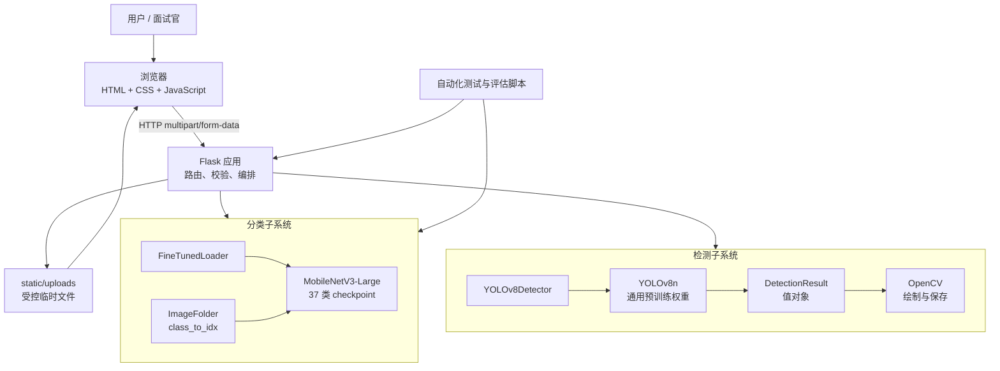

这张图中的关键设计不是“用了多少库”，而是职责方向清楚：浏览器不加载 PyTorch 权重；Flask 不负责学习视觉特征；MobileNet 不知道 HTTP；YOLO 不负责页面展示；OpenCV 不决定目标类别。职责分离使任一组件可以在保持接口契约的情况下替换。

### 3.2 主要文件说明

`app/web_app.py` 是应用入口和协调中心。它创建 Flask 应用，注册 `/`、`/predict`、`/detect` 路由，读取数据集类别名称，缓存模型，保存上传图片，并把模型结果返回给前端。

`app/model_loader.py` 负责分类模型的构建和权重加载。它使用 `ModelLoader` 抽象接口，并由 `FineTunedLoader` 负责创建 MobileNetV3、替换分类头和加载 `.pth` 权重。

`app/object_detector.py` 负责目标检测。`ObjectDetector` 是抽象接口，`YOLOv8Detector` 是基于 Ultralytics 的具体实现，`DetectionResult` 是描述单个检测目标的数据对象。

`app/preprocess.py` 负责检测后的图片处理。YOLO 返回检测结果之后，这个文件用 OpenCV 在原图上绘制矩形框、类别和置信度，并保存一张新的带框图片。

`templates/index.html` 是前端页面。它包含模式切换、拖拽上传、图片预览、置信度滑块、加载状态、错误提示、分类结果和检测结果展示。

`tests/test_env.py` 是环境检查脚本。它不训练模型，而是确认当前 Python 环境是否可以导入 PyTorch、TorchVision、Pillow、OpenCV、Flask 和 Ultralytics，并检查项目中的数据目录和模型文件。

`requirements.txt` 描述项目依赖及版本范围。`README.md` 负责向使用者说明安装、启动、资源文件、数据格式和常见问题。

### 3.3 模块依赖关系

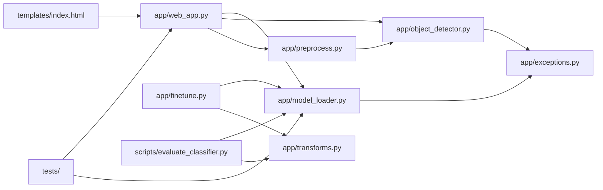

依赖箭头表达“谁知道谁”。例如 `preprocess.py` 可以知道 `DetectionResult` 的字段，因为它要读取坐标；`object_detector.py` 不应该反向导入 Flask，因为检测器应当可以脱离 Web 单独使用。若两个模块相互导入，通常意味着职责边界不清或者需要抽取更稳定的数据契约。

### 3.4 应用启动生命周期

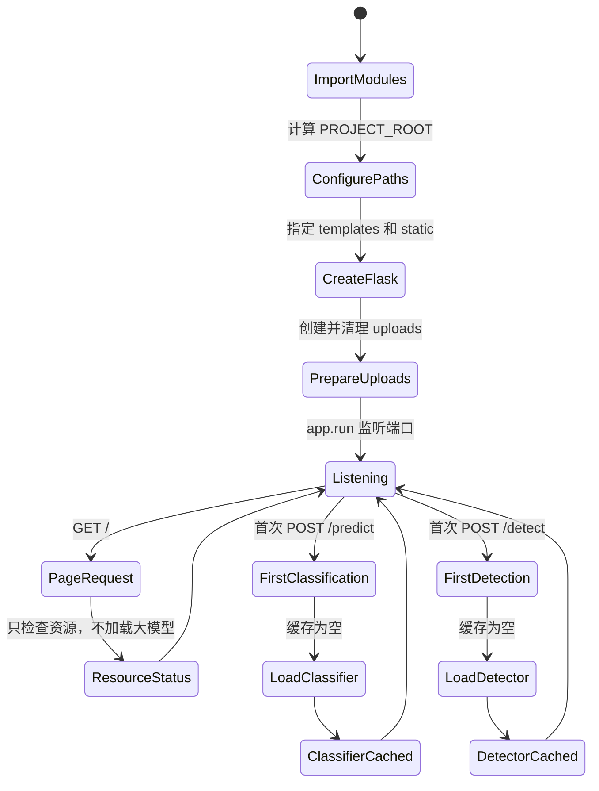

首页不直接加载大模型是有意设计。用户即使缺少权重，也应该先看到页面和资源诊断信息，而不是打开首页就得到 500。模型只在对应能力第一次被调用时加载，此后复用。这种方式叫懒加载；它优化的是启动体验和错误可诊断性，但第一次推理仍会比后续请求慢。

### 3.5 关键设计决策与取舍

| 决策 | 当前方案 | 主要收益 | 代价或局限 |
| --- | --- | --- | --- |
| 分类模型 | MobileNetV3-Large | 轻量、CPU 可运行、迁移学习成熟 | 细粒度类别仍受数据限制 |
| 检测模型 | YOLOv8n 预训练权重 | 集成快、通用目标覆盖广 | 不是自定义宠物品种检测器 |
| Web 框架 | Flask | 简洁、适合教学、接口透明 | 内置 server 不适合公网生产 |
| 类别来源 | ImageFolder 目录排序 | 简单、无需额外标签数据库 | 目录变化会影响映射 |
| 模型加载 | 首次请求懒加载并缓存 | 避免每次重新读权重 | 首次请求延迟更大 |
| 检测输出 | 冻结 dataclass 值对象 | 契约明确、便于序列化 | 复杂任务需扩展字段 |
| 上传存储 | 本地临时目录 | 本机演示简单直观 | 多实例和生产环境不适用 |
| 检测阈值 | 每请求传递 | 无需重载模型、便于实验 | 需校验范围并明确默认值 |

面试官真正关心的通常不是“为什么没有选择另一个热门框架”，而是选择是否与目标一致、是否知道代价、是否保留演进空间。回答时按“目标、方案、收益、局限、下一步”五步展开，比简单列技术名更有说服力。

## 四、数据集与分类任务

### 4.1 Oxford-IIIT Pet 是什么

Oxford-IIIT Pet Dataset 是一个常用于宠物图像分类和分割实验的数据集。当前项目使用它的图像文件和类别文件夹结构。数据集大约包含 37 个宠物类别，既有猫，也有狗。分类类别不是“所有可能的猫品种”，而是数据集实际包含的 37 个类别，例如 Abyssinian、Bengal、Persian、Russian_Blue、Siamese 等。

面试时如果被问“这个项目可以识别金渐层、银渐层和蓝猫吗”，不能直接回答可以。准确回答应该是：

> 当前项目的分类类别由训练目录决定。Oxford-IIIT Pet 中有 Russian_Blue 等类别，但不等同于完整的中文宠物市场品种体系，也不能保证区分金渐层、银渐层这种更细的商业品种。如果要实现这些小类识别，需要重新准备带有明确标签的数据集，按照类别划分训练集和验证集，再重新微调分类模型。

这是一个非常重要的模型能力边界。类别数量不是在网页里随便改出来的，而是由训练时的标签集合、模型最后一层输出维度和类别索引映射共同决定的。

### 4.2 为什么使用文件夹作为标签

项目使用 `torchvision.datasets.ImageFolder`。它要求目录大致如下：

```text
data/oxford_pet_split/
  train/
    Abyssinian/
      Abyssinian_1.jpg
    Bengal/
      Bengal_1.jpg
    Russian_Blue/
      Russian_Blue_1.jpg
  val/
    Abyssinian/
    Bengal/
    Russian_Blue/
```

`ImageFolder` 会扫描 `train` 下的子文件夹，并按照名称排序建立类别索引。例如类别可能被映射成：

```text
0 -> Abyssinian
1 -> Bengal
2 -> Birman
...
```

模型输出的不是字符串，而是一组数字 logits。程序先通过 `softmax` 把 logits 转成概率，再用预测索引访问 `class_names`，最后得到 `label` 和 `score`。所以如果训练时的文件夹顺序和推理时读取的文件夹顺序不一致，就会出现“模型数值看起来正常，但类别名称错位”的严重问题。

### 4.3 train 和 val 的作用

`train` 用于模型学习，模型参数会根据训练样本和损失函数更新。`val` 用于验证模型在没有参与参数更新的数据上的表现，帮助判断模型是否过拟合。

网页分类推理主要读取 `train` 目录下的类别名称，因为 `ImageFolder(train_dir)` 能得到类别列表。它不是在网页上重新训练，也不是通过验证集推理。验证集更主要用于训练阶段评估模型，而不是网页上线时的类别字典。

### 4.4 数据划分脚本

项目中的 `scripts/split_oxford_pet.py` 用于把原始 `images` 文件夹按比例拆分为 `train` 和 `val`。划分时需要固定随机种子，例如 `42`，这样相同的原始数据和参数可以得到相同的划分结果。

面试官可能追问为什么要固定随机种子。回答是：数据划分具有随机性，如果每次运行结果都不同，就很难比较两次训练的性能差异。固定种子不能保证所有硬件和所有算子完全一致，但可以显著提高实验可复现性。

## 五、MobileNetV3 分类模型

### 5.1 为什么使用预训练模型

从零开始训练一个深度卷积网络需要大量数据、时间和计算资源。ImageNet 预训练模型已经学习了边缘、纹理、颜色、形状等通用视觉特征。项目通过迁移学习复用这些特征，只把最后的分类任务改成自己的宠物类别。

这里的“预训练”与“微调”要区分：预训练是模型在大型通用数据集上先学过；微调是把这个模型拿到当前任务的数据上继续训练。第六课的分类模型属于微调后的模型。第七课的 YOLO 在当前项目中没有针对本项目数据继续微调，只是直接使用预训练权重做推理。

### 5.2 MobileNetV3 的选择理由

MobileNetV3 是面向移动端和资源受限设备设计的轻量级卷积神经网络，相较于更大的模型，它通常具有更少的参数量和更低的推理开销。对于课堂项目和本地 Web 演示，MobileNetV3 可以在 CPU 上完成推理，启动和响应都比较容易接受。

选择模型时不能只看精度，还要考虑模型大小、推理速度、部署环境、依赖复杂度和学生是否容易运行。当前项目的目标是教学和作品展示，因此选择一个结构清楚、资源要求相对适中的模型是合理的。

### 5.3 分类头为什么要替换

ImageNet 模型原本有自己的类别数量，例如 1000 类。当前数据集有 37 类，所以必须把最后的线性层输出维度替换为 37。`build_finetune_model()` 通过读取分类器输入维度，创建 `nn.Linear(in_features, num_classes)`，让模型输出维度和自定义数据集一致。

如果不替换分类头，模型可能仍然输出 ImageNet 的类别数量，无法与当前数据集的标签正确对应。如果类别数量是 2，最后一层就应该输出 2 个值；如果是 37，就应该输出 37 个值。网页上的 Top-3 只是从模型已经输出的类别中选前三个，并不会创造新的类别。

### 5.4 冻结特征层是什么意思

迁移学习常见策略是冻结前面的特征提取层，只训练最后的分类头。冻结意味着把参数的 `requires_grad` 设置为 `False`，反向传播时这些参数不更新。前面层学习的是较通用的边缘和纹理，最后几层更接近具体类别。

冻结的优点是训练更快、需要的数据更少、过拟合风险相对低。缺点是如果新任务和原始任务差异很大，通用特征可能不够，需要解冻更多层甚至全量微调。当前项目的 Web 推理只加载已经生成的 checkpoint，不在请求期间训练。

### 5.5 分类推理的完整过程

分类推理大致经过以下步骤：

1. 浏览器把图片作为 multipart/form-data 发给 `/predict`。
2. Flask 检查是否有文件、文件名是否为空、扩展名是否允许。
3. Pillow 打开图片并执行 `verify()`，确认它不是一个只改了扩展名的损坏文件。
4. 程序把图片转换成 RGB，缩放到 256，再中心裁剪到 224×224。
5. 图片转换成 Tensor，并使用 ImageNet 的均值和标准差进行归一化。
6. Tensor 增加 batch 维度，变成类似 `[1, 3, 224, 224]` 的输入。
7. 模型在 `torch.no_grad()` 环境下执行前向推理。
8. 通过 `softmax` 得到各类别概率。
9. 通过 `torch.topk` 取概率最高的三个类别。
10. 把类别索引映射为类别名称，四舍五入后返回 JSON。

使用 `torch.no_grad()` 的原因是推理阶段不需要计算梯度。它可以减少显存或内存占用，也不必保存反向传播所需的中间结果。

分类请求的时序可以进一步表示为：

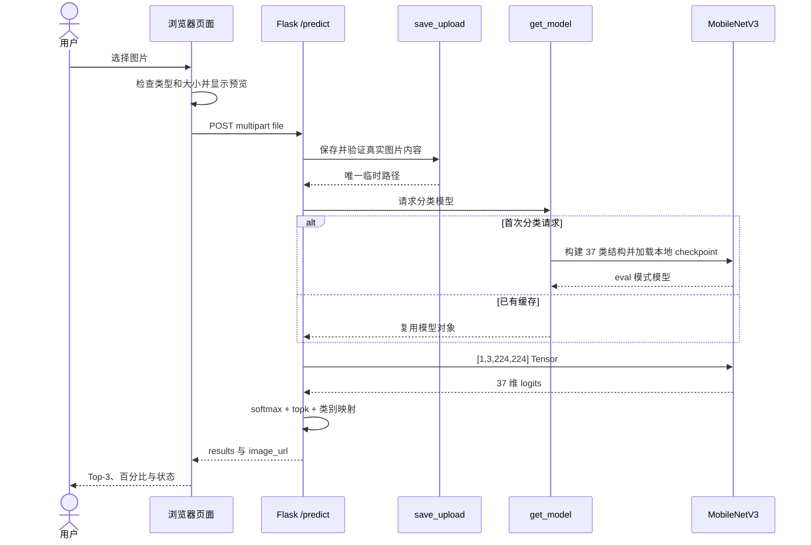

这里要区分三种“输出”：神经网络直接输出的是 logits；Softmax 输出的是总和为 1 的相对分数；API 输出的是经过类别映射和百分比格式化后的业务 JSON。把三者混成“模型直接返回标签”会掩盖中间的重要转换。

### 5.5.1 微调策略如何选择

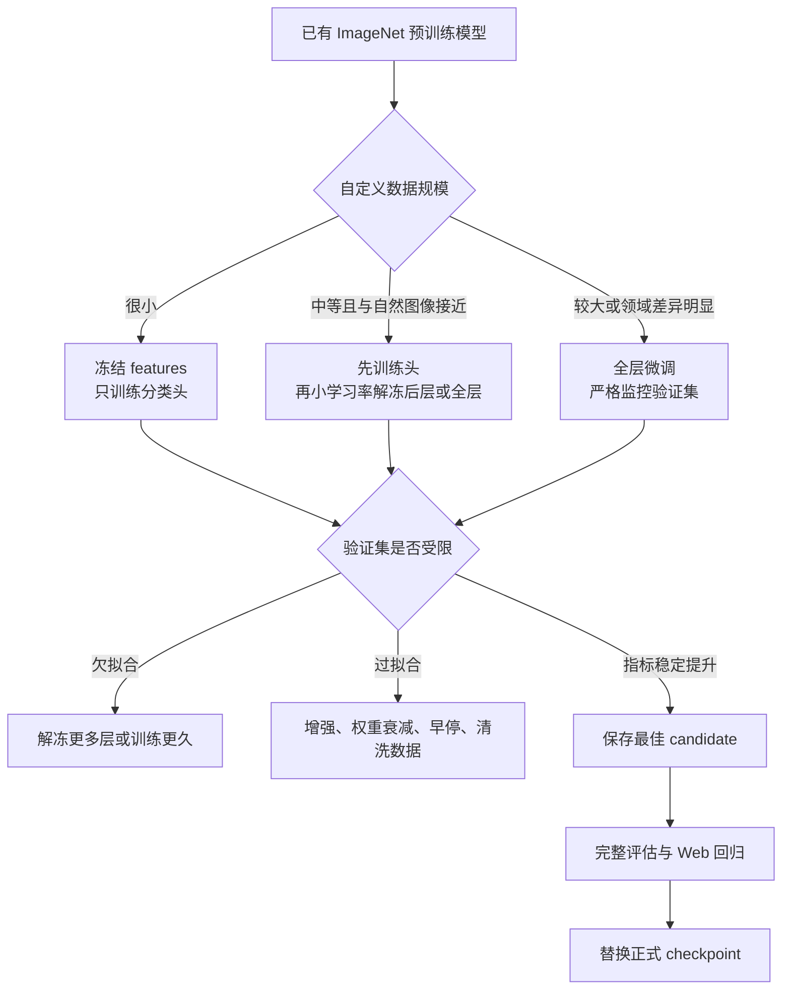

当前 90.19% checkpoint 的改进属于“从已有 checkpoint 继续全模型微调”：使用较小学习率 `0.0001`、AdamW、`0.0001` 权重衰减、`0.1` label smoothing 和 cosine annealing。它不是 LoRA。LoRA 是参数高效微调方法，常见于大语言模型和部分视觉 Transformer；本项目直接解冻并更新 MobileNetV3 的原参数。

### 5.6 为什么要保持预处理一致

训练阶段和推理阶段必须使用相互匹配的预处理。如果训练时图片被归一化，而推理时没有归一化，模型看到的数值分布会发生变化，预测质量会下降。训练时如果使用中心裁剪，推理时也应该保持相似的尺寸和裁剪策略。

这也是面试中常见的追问：“图片为什么要 Resize 和 Normalize？”Resize 和 Crop 是为了统一输入尺寸；Normalize 是为了让输入数据分布与预训练模型期望的分布相近，帮助模型稳定工作。

## 六、YOLOv8 目标检测模型

### 6.1 分类和检测的区别

分类通常针对整张图片输出一个或多个类别概率。例如一张猫的图片，分类模型输出“Persian 70%”。它不一定知道猫在图片的哪个位置。

检测会输出多个对象，每个对象包含类别、置信度和边界框坐标。例如：

```json
{
  "label": "cat",
  "confidence": 92.4,
  "x1": 42.1,
  "y1": 18.3,
  "x2": 508.7,
  "y2": 390.2
}
```

因此分类回答“整张图是什么”，检测回答“图里有什么以及在哪里”。一张图可以只有一个检测目标，也可以有多个目标。

### 6.2 当前 YOLO 的真实用途

第七课的 YOLO 使用 `yolov8n.pt`。其中 `n` 表示 nano 版本，模型相对轻量，适合课堂演示和 CPU 推理。当前代码把 YOLO 当成一个通用检测器，并没有使用 Oxford-IIIT Pet 的分类标注去训练检测框，也没有训练金渐层、银渐层、蓝猫的检测类别。

所以当面试官问“你是否训练了 YOLO”时，准确回答是：

> 没有。当前项目直接加载官方预训练的 YOLOv8n 权重，用于展示目标检测流程。第七课的重点是理解检测模型如何接入 Web、如何接收阈值、如何返回框坐标，以及如何用 OpenCV 把结果画回图片。如果要让 YOLO 识别自定义品种，需要准备带边界框的标注数据，使用 YOLO 格式训练集，再执行 `model.train()` 微调，并替换 Web 端使用的权重文件。

### 6.3 YOLO 的输出

Ultralytics 的 YOLO 调用模型后会返回结果对象。每一个检测框一般包含：

- `xyxy`：左上角和右下角坐标。
- `conf`：模型对这个目标的置信度。
- `cls`：类别索引。
- `names`：类别索引到类别名称的映射。

`YOLOv8Detector.detect()` 把这些库对象转换成项目自己的 `DetectionResult`。这样 Web 层不需要依赖 Ultralytics 的内部对象格式，后续如果换成其他检测框架，只要继续返回项目定义的结果类型即可。

### 6.4 置信度阈值是什么

置信度阈值不是模型重新学习的参数，而是推理时的筛选条件。如果阈值是 0.5，程序只保留置信度不低于 0.5 的检测结果。阈值降低到 0.3，可能保留更多目标，但误检也可能增加；提高到 0.7，结果更严格，可能过滤掉一些真实目标。

网页上的滑块把阈值发送给 `/detect`。后端通过 `parse_conf_threshold()` 将表单值转成浮点数，并验证它必须在 0 到 1 之间。`YOLOv8Detector.detect()` 接收本次请求的阈值，将它传给模型调用，并在结果转换时再次过滤。

这里有两个层次：构造函数里的 `0.5` 是默认阈值；请求传入的 `0.3` 或 `0.7` 是本次推理使用的阈值。当前修复后，调整阈值只影响本次推理，不会重新创建 YOLO 模型对象。

阈值控制链路如下：

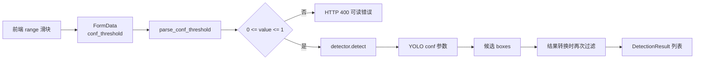

为什么既传给 YOLO 又在转换时过滤？前者让模型框架在推理阶段减少低分结果，后者保护项目自己的输出契约，确保最终列表不包含低于调用阈值的对象。两层过滤不是训练，也不会改变权重。

从指标角度看，阈值是 precision 与 recall 之间的业务取舍。降低阈值通常提高召回倾向，但可能增加误检；提高阈值通常提高结果纯度，但可能漏检。正确选择方式是在代表性验证数据上画 precision-recall 曲线或比较多个候选阈值，而不是只看一张演示图片。

### 6.5 为什么模型只加载一次

模型权重可能有数 MB 到数百 MB。加载模型包括读取磁盘文件、创建网络结构和初始化运行环境，如果每次上传图片都重新加载，响应会很慢，内存也会频繁分配。

因此 `web_app.py` 使用模块级 `_detector` 缓存。第一次调用 `get_detector()` 时创建 `YOLOv8Detector`，之后直接返回已有对象。分类模型也有类似的 `_model` 缓存。

之前按阈值缓存检测器会导致每次滑块变化都重新加载权重，这不合理。现在检测器和阈值被分开：检测器负责持有模型，阈值属于一次请求的输入。这个设计更符合职责分离，也更适合实际 Web 服务。

## 七、OpenCV 在系统中的作用

### 7.1 OpenCV 不是本项目的主要识别模型

OpenCV 是一个计算机视觉和图像处理库，本身提供读图、写图、缩放、颜色转换、滤波、边缘检测、几何变换、视频读取等大量功能。它可以实现一些传统计算机视觉算法，但本项目并没有使用 OpenCV 来完成宠物类别识别或 YOLO 检测。

本项目中，YOLO 负责“识别目标并返回坐标”，OpenCV 负责“把坐标和文字画在图片上并保存”。两者关系可以说是模型推理和后处理的分工：

```text
YOLOv8
  输入图片
  输出类别、置信度、坐标

OpenCV
  输入原图和 YOLO 输出
  绘制矩形框、颜色、标签
  保存带框图片
```

### 7.2 `cv2.imread`、`rectangle`、`putText`、`imwrite`

`cv2.imread(str(source))` 从磁盘读取图片。返回值为 `None` 时，说明文件不存在、格式不支持或图片损坏，程序会抛出错误。

`cv2.rectangle()` 根据左上角和右下角坐标绘制边界框。代码会把坐标限制在图片宽高范围内，避免异常坐标导致绘制错误。

`cv2.putText()` 在图片上写类别和置信度，例如 `cat: 92.4%`。在写文字前，代码通过 `cv2.getTextSize()` 计算文字大小，并先绘制一个有颜色的背景矩形，提升文字可读性。

`cv2.imwrite()` 将处理后的图片保存到 `static/uploads`。当前代码检查其返回值，如果保存失败就抛出异常，而不是假装成功后返回一个不存在的 URL。

## 八、Flask 后端与接口设计

### 8.1 Flask 在项目中的角色

Flask 是一个 Python Web 框架。它负责监听 HTTP 请求、根据 URL 和方法调用对应函数、解析上传文件、返回 HTML 或 JSON。

Flask 不负责训练模型，也不是模型本身。它是把模型能力包装成用户可以访问的 API 的应用层工具。

### 8.2 首页 `/`

用户访问 `/` 时，服务器返回 `templates/index.html`。当前首页不会直接加载 MobileNetV3 或 YOLO 模型，只会检查数据目录、类别目录、模型路径和 Ultralytics 是否可用，然后把状态传给页面。

这样做解决了一个实际问题：如果模型文件还没有准备好，首页仍然可以打开，并明确告诉用户缺少什么，而不是直接显示一个没有上下文的 Internal Server Error。模型只在真正进行分类或检测时加载。

### 8.3 分类接口 `/predict`

`/predict` 只接受 POST 请求。请求中需要有名为 `file` 的 multipart 文件字段。接口会先检查字段是否存在、文件名是否为空，再调用 `save_upload()`。

保存之后，`predict_image()` 完成预处理和模型推理，最终返回：

```json
{
  "results": [
    {"label": "Persian", "score": 72.45},
    {"label": "Birman", "score": 12.31},
    {"label": "Ragdoll", "score": 8.44}
  ],
  "image_url": "/static/uploads/xxx_sample.jpg",
  "model_path": "models/oxford_pet_mobilenet_epoch1.pth",
  "data_root": "data/oxford_pet_split"
}
```

`score` 是百分数形式，前端直接用它绘制百分比条。接口中返回的是项目相对路径，而不是 `C:\Users\...` 这样的本机绝对路径，这样可以避免泄漏本机目录结构，也便于页面展示。

### 8.4 检测接口 `/detect`

`/detect` 和 `/predict` 一样接收图片，但额外接收 `conf_threshold` 字段。它执行以下操作：

1. 解析并验证阈值。
2. 保存并验证图片。
3. 获取缓存中的 YOLO 检测器。
4. 把当前阈值传给检测器。
5. 把检测结果转换成字典。
6. 使用 OpenCV 生成带框图片。
7. 返回检测列表、检测数量、阈值、原图 URL 和结果图 URL。

接口返回的 `image_url` 指向带框图片，`source_image_url` 指向原始上传图片。前端在检测模式下显示带框结果，同时在下方列出类别、置信度和坐标。

两个接口共享上传与错误处理，但调用不同模型：

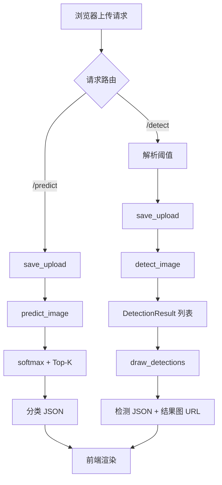

### 8.4.1 API 契约为什么重要

API 契约是前后端共同依赖的字段、类型、状态码和语义。分类前端预期 `results` 是数组，每一项包含字符串 `label` 和百分数 `score`；检测前端预期 `detections`、`count`、`image_url` 和 `conf_threshold`。如果后端把 `score` 从百分数改成 0 到 1 的小数而不更新前端，页面进度条会错误；如果把错误字段从 `error` 改名，前端可能只显示通用失败。

因此测试不能只检查函数“有返回值”，还要检查 JSON 结构、字段类型、HTTP 状态码和静态图片可访问性。未来可以使用 Pydantic、OpenAPI 或 JSON Schema 将契约形式化，但当前项目通过清晰的构造代码和接口测试维护契约。

### 8.5 为什么返回 JSON

JSON 是前后端之间通用、结构清晰、JavaScript 可以直接解析的数据格式。相比后端直接拼接 HTML，返回 JSON 可以让前端决定结果如何展示，也便于未来增加移动端、桌面端或其他调用方。

例如后端只需要返回：

```json
{"label": "cat", "confidence": 92.4, "x1": 20, "y1": 30, "x2": 400, "y2": 380}
```

前端可以把它显示为列表、表格、卡片或图表。后端和显示层之间的耦合更低。

## 九、上传校验、异常处理与资源清理

### 9.1 为什么只检查扩展名不够

文件名叫 `cat.jpg` 并不能证明它真的是 JPG。用户可以把文本文件改名为 `.jpg`，也可能上传损坏的图片。如果直接交给模型或 OpenCV，可能产生难以理解的错误。

当前 `save_upload()` 先使用 `secure_filename()` 清理文件名，再限制扩展名为 `.jpg`、`.jpeg`、`.png`、`.bmp` 或 `.webp`，保存后使用 Pillow 的 `Image.open()` 和 `verify()` 检查图片内容。验证失败就删除文件，并返回清晰的 400 错误。

扩展名检查是第一道门，真实图片解析是第二道门，16 MB 的 `MAX_CONTENT_LENGTH` 是大小限制。前端也进行一次格式和大小检查，但前端检查不能代替后端检查，因为用户可以绕过浏览器直接调用 API。

### 9.2 异常为什么要分级

所有错误都返回 500 会让用户无法区分问题原因。当前接口根据错误类型返回不同状态：

- 400：上传文件无效、阈值格式错误、阈值超出范围。
- 413：上传文件超过 16 MB。
- 503：模型、依赖、数据资源缺失或模型加载失败。
- 500：未预期的服务器异常，同时在终端记录日志。

面试官如果问“为什么不把异常全部暴露给用户”，回答是：内部异常可能包含本机路径、堆栈和实现细节，直接暴露会影响安全性和用户体验。对用户应该返回可操作的提示，对开发者则通过日志保留排查信息。

异常处理决策如下：

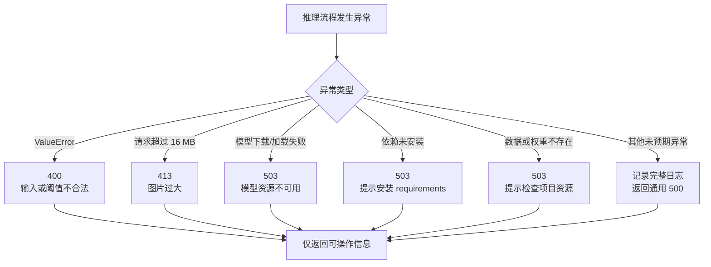

状态码表达责任归属：400 和 413 表示当前请求不符合要求；503 表示服务依赖的模型或资源暂时不可用；500 表示服务内部出现未预期问题。正确状态码既帮助前端显示合适提示，也便于日志和监控统计。

### 9.3 为什么要清理上传文件

演示系统每上传一次图片都会产生源图和检测结果图。如果不清理，连续练习几天后 `static/uploads` 可能堆积大量文件，占用磁盘并暴露历史图片。

当前项目在启动和保存图片时执行清理：删除超过 24 小时的文件，并且最多保留 100 个近期文件。`.gitkeep` 不会被删除。这个策略适合课堂演示和本地作品展示；如果是正式生产系统，还应该使用对象存储、数据库记录、定时任务、用户权限和更严格的隐私策略。

## 十、CPSC210 面向对象设计对应关系

### 10.1 抽象和接口

`ModelLoader` 定义了 `load_model()`，`ObjectDetector` 定义了 `detect()`。它们表达的是“调用方需要什么能力”，而不是“具体模型内部如何实现”。

例如 Web 层只需要调用：

```python
detector = get_detector()
detections = detector.detect(image_path, conf_threshold=threshold)
```

它不需要知道 Ultralytics 的模型对象、权重加载细节和结果对象内部结构。

这就是面向接口编程的一个实际例子。以后可以新增 `MockDetector` 用于测试，也可以接入另一个模型，只要它遵守 `ObjectDetector` 规定的接口，Web 层就不必大幅修改。

### 10.2 继承与多态

`YOLOv8Detector(ObjectDetector)` 表示 YOLOv8 检测器是抽象检测器的一种实现。代码可以把它当成 `ObjectDetector` 使用，这体现了多态：同一个 `detect()` 调用可以由不同的具体检测器完成。

`FineTunedLoader(ModelLoader)` 表示微调分类模型加载器是模型加载器的一种实现。未来还可以有 `ResNetLoader`、`MobileNetLoader` 或测试用加载器。

### 10.3 值对象 `DetectionResult`

`DetectionResult` 是一个冻结的 dataclass，存储一个目标的坐标、类别和置信度。它不是模型，也不是执行推理的服务，而是把推理结果作为一个稳定的数据值在模块之间传递。

使用值对象的好处是：字段明确、构造简单、不会因为字典键写错而悄悄失败、可以统一实现 `to_dict()`。`frozen=True` 表示创建后不能随意修改，能减少结果在传递过程中被意外改变。

面试时可以这样解释：

> 模型负责产生结果，值对象负责承载结果，Web 层负责把结果序列化给前端。三者职责不同，所以我没有让模型直接返回页面需要的 JSON，也没有让前端了解 Ultralytics 的内部对象。

### 10.4 单一职责

`web_app.py` 目前是应用协调中心，但具体职责已经拆到不同模块：模型加载在 `model_loader.py`，检测抽象在 `object_detector.py`，绘图在 `preprocess.py`。这种拆分让代码更容易阅读和替换。

严格来说，`web_app.py` 仍然承担较多编排职责，后续可以继续拆分成 `services`、`routes`、`schemas` 和 `config`，但对于当前课堂项目，这样的模块边界已经能体现基本的单一职责意识。

类之间的关系可以用简化类图表示：

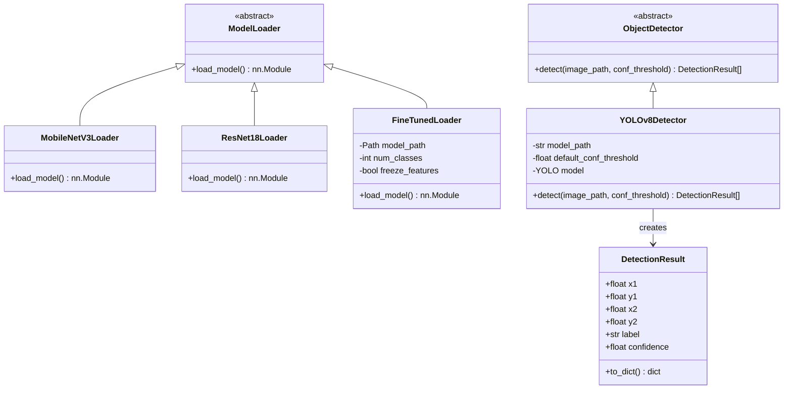

这张图也解释了“实例”和“值对象”的差别。`YOLOv8Detector` 实例具有行为和长期状态，持有可复用模型并执行 `detect()`；`DetectionResult` 主要表达一次检测得到的数据值，创建后被冻结。并不是所有对象都应该是值对象，也不是值对象不能有任何方法；`to_dict()` 是围绕值本身的转换行为，不会重新做模型推理。

## 十一、前端页面与用户体验

### 11.1 页面工作流

用户打开页面后可以在“图像分类”和“目标检测”之间切换。选择图片后，前端使用 `FileReader` 显示本地预览，并自动向后端发起请求。请求过程中按钮和滑块被禁用，页面显示加载状态；请求完成后显示成功结果；失败时显示后端返回的错误信息。

### 11.2 分类结果展示

分类模式显示 Top-3 结果。每条结果包含排名、类别名称、概率数值和进度条。Top-1 用更明显的视觉样式表示，但不能误解为绝对正确答案，因为模型概率是模型输出的相对置信程度，不是现实世界中的保证。

### 11.3 检测结果展示

检测模式显示检测后的图片、目标总数、每个目标的类别和置信度，以及坐标信息。滑块改变后，如果已经选中图片，前端会重新请求 `/detect`，从而直观看到阈值改变带来的结果数量变化。

### 11.4 可访问性和输入体验

上传区域支持点击、拖拽和键盘 Enter/空格操作。前端对文件类型和大小做即时提示，后端再次执行同样的安全检查。按钮在请求过程中禁用，避免用户快速连续点击造成重复请求。

如果继续打磨，可以把当前单文件模板中的 CSS 和 JavaScript 拆到 `static/css` 和 `static/js`，增加单元测试和端到端测试，并让页面在手机屏幕上进一步优化。但当前页面已经包含作品展示所需的主要交互状态。

## 十二、运行环境与复现流程

### 12.1 为什么需要 Conda 环境

PyTorch、TorchVision、OpenCV、Ultralytics 等库有较多二进制依赖。不同项目如果共用系统 Python，可能出现版本冲突，例如一个项目需要某版本 Torch，另一个项目需要不同版本。

Conda 环境可以把项目依赖隔离。关键不是“必须叫 pytorch_env”，而是安装依赖和运行项目必须使用同一个 Python。

推荐流程：

```bash
conda activate pytorch_env
pip install -r requirements.txt
python tests/test_env.py
python app/web_app.py
```

然后打开 `http://127.0.0.1:5000`。`pip install -r requirements.txt` 的作用是读取依赖清单，并把项目运行需要的包安装到当前激活的环境中。它不是启动项目，也不是下载训练数据。

### 12.2 如何解释 Flask development server warning

Flask 自带的服务器用于本地开发和课堂演示。出现：

```text
WARNING: This is a development server.
```

并不代表当前项目启动失败，它只是提醒不要把这个服务器直接用于高并发生产部署。正式部署应该使用 Waitress、Gunicorn、uWSGI 或其他生产级 WSGI 服务器，并配合反向代理、进程管理、日志、超时、权限和安全配置。

### 12.3 Ultralytics 配置目录

项目把 `YOLO_CONFIG_DIR` 指向仓库内的 `.ultralytics`，避免 Ultralytics 试图写入用户目录时遇到权限问题。项目还设置 `YOLO_AUTOINSTALL=false`，避免用户上传一张图片时，库在后台自动执行 pip 或联网安装依赖。

这种做法的工程意义是：依赖应该在启动前明确安装，而不是在一次用户请求期间悄悄改变环境。这样错误更容易复现，也更符合部署原则。

## 十三、测试与验证方式

### 13.1 语法编译检查

可以运行：

```bash
conda run -n pytorch_env python -m compileall app tests
```

它主要检查 Python 文件能否被解释器编译，能够发现缩进错误、括号错误和语法错误，但不能证明模型输出正确，也不能代替功能测试。

### 13.2 环境检查

`tests/test_env.py` 会检查核心包导入、分类数据目录、分类权重、可选的 YOLO 本地权重和样例图片读取。它不向 `images` 目录写入测试结果，避免测试过程产生脏文件。

### 13.3 Flask 接口测试

Flask 的 `test_client()` 可以在不启动真实浏览器的情况下访问 `/`、`/predict` 和 `/detect`。项目实际验证过以下行为：

- 首页在资源正常时返回 200。
- 首页在分类资源缺失时仍返回 200，并显示诊断信息。
- 分类接口对有效图片返回结果。
- 检测接口可以接收不同阈值。
- 同一进程中多次检测复用检测器。
- 损坏图片返回 400。
- 超大请求返回 413。

### 13.4 还可以增加什么测试

如果向生产质量靠近，可以增加 pytest 测试：测试 `parse_conf_threshold()` 的边界值 0、1、负数、超过 1 和非数字；测试 `save_upload()` 拒绝错误扩展名和损坏图片；使用 mock 模型测试 `predict_image()` 是否正确取 Top-3；使用 fake detector 测试阈值传递；测试 `draw_detections()` 在 `cv2.imwrite` 失败时是否抛出异常。

真正的模型质量还需要独立的评估脚本，计算 accuracy、precision、recall、F1、混淆矩阵，以及检测任务的 precision、recall 和 mAP。接口测试只能证明系统能运行，不能证明模型一定准确。

### 13.5 测试金字塔与证据链

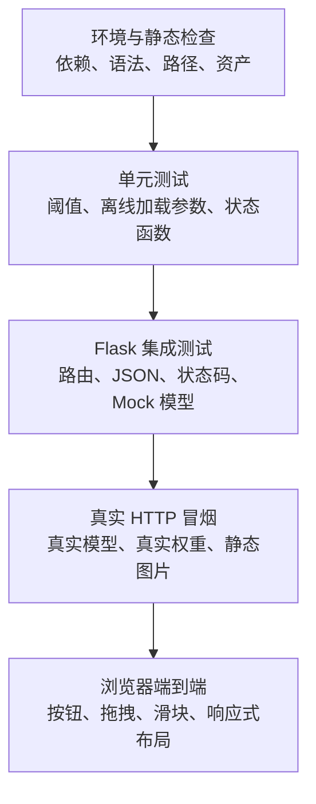

每一层回答不同问题：

| 测试层 | 能证明什么 | 不能证明什么 |
| --- | --- | --- |
| 环境检查 | 包能导入、关键文件存在 | 模型预测是否正确 |
| 单元测试 | 小函数和加载参数符合预期 | 模块组合后是否工作 |
| Mock 接口测试 | 路由、状态码、JSON 契约正确 | 真实权重是否可加载 |
| 真实 HTTP | 服务与真实模型能形成闭环 | 所有浏览器交互是否正确 |
| 浏览器端到端 | 用户按钮、上传、切换和展示可用 | 大规模模型准确率 |
| 验证集评估 | 模型在固定数据上的指标 | 生产环境全部分布表现 |

当前项目已验证 9 项自动化测试、真实首页与两个接口、浏览器分类和检测流程。分类模型另由 `scripts/evaluate_classifier.py` 在 1,478 张验证图片上评估。把这些证据一起陈述，才比一句“我测试过了”更可信。

## 十四、性能与工程优化

### 14.1 已完成的优化

第一，分类模型和检测模型都采用懒加载加缓存。程序启动时不强制加载所有权重，第一次真正使用时才加载，之后复用。

第二，分类推理使用 `eval()` 和 `torch.no_grad()`。`eval()` 让 Dropout、BatchNorm 等层进入推理行为，`no_grad()` 减少梯度相关开销。

第三，YOLO 阈值不再触发模型重建。阈值属于请求数据，模型权重属于长期资源。

第四，上传文件有大小、格式和内容校验，并自动清理过期文件。

第五，错误信息分级，首页资源缺失时不再直接 500。

### 14.2 当前性能瓶颈

当前项目主要是单机 CPU 演示，YOLO 和 MobileNet 的推理速度会受到 CPU、图片尺寸、模型版本和并发请求影响。Flask 开发服务器也不是高并发服务器。

另外，前端每次重新检测都会重新上传原图，而不是只发送阈值并复用服务器端文件。这种设计简单、容易理解，但在真实系统中可以为上传图片生成任务 ID，后续只传任务 ID 和阈值，减少网络传输。

### 14.3 如果要上线会怎么改

可以把模型服务和 Web 服务拆开，使用生产级 WSGI 或 ASGI 服务器；用 Redis 或队列处理耗时推理；使用对象存储保存图片；使用数据库记录任务和结果；通过 Docker 固定系统依赖；增加认证、限流、日志、监控、健康检查和超时；使用 GPU 或模型量化加速；通过批量推理提高吞吐量。

但是这些改动不能全部一次加入课堂项目。工程设计要考虑目标。当前目标是可教学、可复现和可展示，因此保持结构清楚比提前引入复杂基础设施更重要。

生产演进可以分阶段进行：

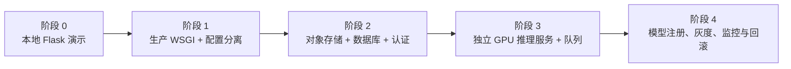

阶段 1 先解决开发服务器、日志、环境变量和健康检查；阶段 2 解决多用户、图片生命周期和权限；阶段 3 解决长耗时推理、并发和资源隔离；阶段 4 解决模型版本治理与线上质量。面试中这样分阶段比一次性罗列 Docker、Kubernetes、Redis 更专业，因为每项基础设施都对应具体问题。

## 十五、项目局限与诚实回答方式

面试官通常更信任能主动说出局限的人。当前项目至少有以下限制：

1. 分类模型的训练数据规模和训练轮数有限，不能把课堂 checkpoint 宣称成工业级模型。
2. Oxford-IIIT Pet 的类别不等于现实世界所有猫狗品种，不能直接支持金渐层、银渐层等新类别。
3. YOLO 没有使用本项目自定义标注进行微调，因此不能声称它已经学会了新的检测类别。
4. 当前 YOLO 主要用于通用目标检测，检测到 cat 不代表能识别具体猫品种。
5. 当前使用 Flask 开发服务器，只适用于本地演示。
6. 当前上传文件清理策略是本地临时文件策略，不是完整的生产隐私方案。
7. 分类模型已有 1,478 张验证图片上的 Top-1 评估，但还没有提交混淆矩阵、precision、recall、F1 和置信度校准报告；通用 YOLO 也没有针对本项目场景建立专门检测评估集。
8. 页面和部分前端逻辑仍集中在一个模板文件中，后续可以拆分静态资源。

### 15.1 模型能力边界图

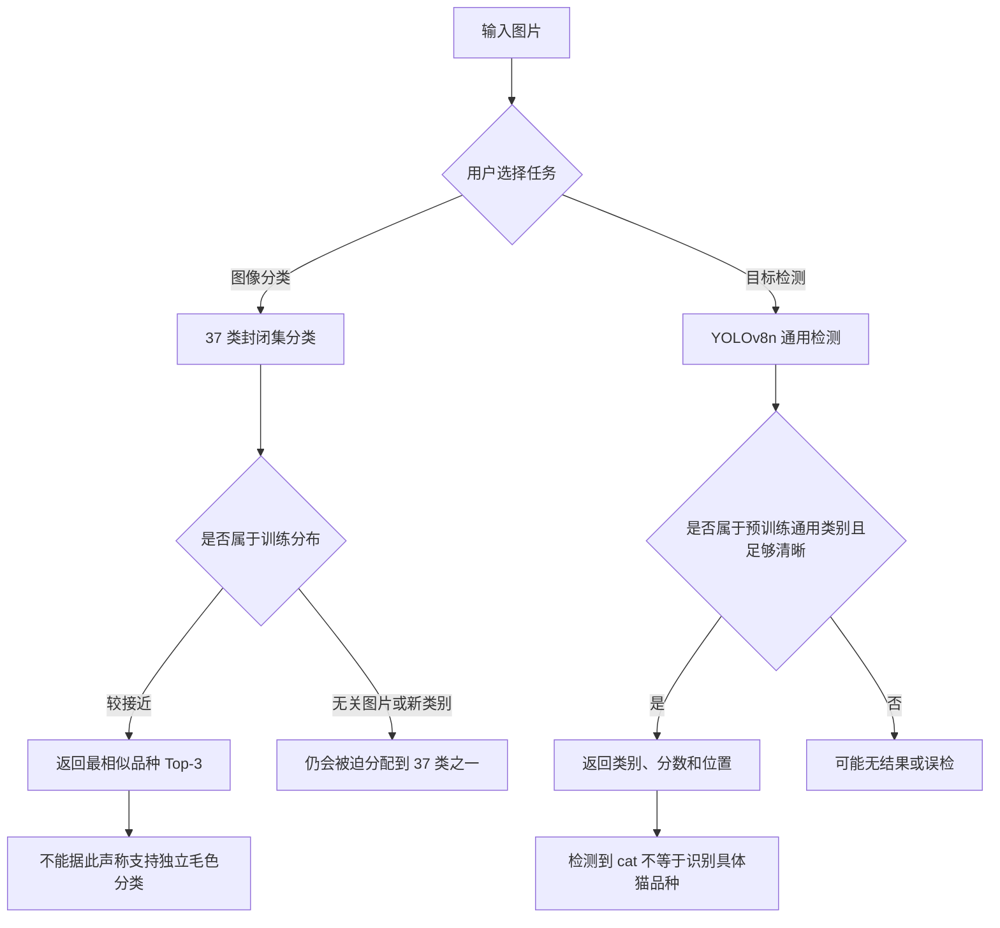

项目边界不是缺点清单，而是模型与数据定义的直接结果。封闭集分类器没有 unknown 输出；通用检测器没有本项目自定义品种类别；Oxford-IIIT Pet 没有金渐层、银渐层和蓝猫的独立毛色标注。改进必须从任务定义和数据标签开始，而不是只改前端文案或 Top-K 数字。

如果面试官问“这个项目还有什么不足”，不要只说“没有不足”。可以回答：

> 当前版本优先实现了从模型到 Web 的完整闭环，并完成了资源检查、错误处理和临时文件清理。下一步我会补充独立模型评估、更加严格的自动化测试、前端静态资源拆分，以及带自定义边界框标注的检测数据和 YOLO 微调流程。这样可以把课堂演示项目继续推进到更接近生产的版本。

## 十六、面试高频问题与参考回答

### 问题 1：请你介绍一下这个项目

参考回答：

> 这是一个图像识别 Web 应用，包含图像分类和目标检测两种模式。分类部分使用基于 MobileNetV3 的宠物细分类模型，类别名称来自 Oxford-IIIT Pet 数据集；检测部分使用 Ultralytics 提供的 YOLOv8n 预训练模型。用户通过 Flask 页面上传图片，后端校验并保存图片，调用对应模型推理，然后以 JSON 形式返回结果。检测结果还会交给 OpenCV 绘制边界框并保存带框图片，前端再展示 Top-3、检测目标、置信度和坐标。项目同时处理了模型缓存、阈值传递、路径、异常、上传大小和临时文件清理等工程问题。

### 问题 2：分类和检测为什么要用两个模型

参考回答：

> 两个任务的输出目标不同。分类只需要判断整张图片属于什么类别，MobileNetV3 这类分类模型就足够；检测需要同时找到多个目标的位置并判断类别，需要输出边界框，因此使用 YOLO。把两个模型放在同一个 Web 系统里，是为了展示不同视觉任务的差异，而不是因为一个模型不能运行。

### 问题 3：YOLO 是你训练的吗

参考回答：

> 当前第七课没有重新训练 YOLO，而是直接使用 `yolov8n.pt` 预训练权重做推理。第七课的重点是模型集成和 Web 闭环。如果要做真正的自定义猫品种检测，需要准备带框标注的数据，转换成 YOLO 数据格式，训练或微调 YOLO，再在代码中替换权重路径。

### 问题 4：为什么 Top-3 只有两个结果

参考回答：

> Top-K 只能从模型实际输出的类别中取结果。如果训练集只有 cat 和 dog 两个类别，模型输出维度就是 2，Top-3 最多只能返回两个。如果是当前 Oxford-IIIT Pet 的 37 类版本，理论上可以返回最多三个类别。网页上的 Top-3 是展示策略，不会改变模型类别数量。

### 问题 5：置信度阈值是模型参数吗

参考回答：

> 它不是训练权重，而是推理时的筛选参数。模型先产生候选框和置信度，程序再根据阈值决定哪些框保留下来。阈值低，召回倾向更高但误检可能增加；阈值高，结果更严格但可能漏掉低置信度目标。当前网页把阈值传给 `/detect`，每次请求单独使用，不会改变模型权重。

### 问题 6：为什么要把模型缓存起来

参考回答：

> 模型加载包括创建网络结构和读取权重，成本远高于对一张图片做一次前向推理。如果每次请求重新加载，用户会明显感觉到延迟，内存也会重复分配。因此第一次请求时懒加载，之后复用模型对象。当前还把阈值和模型对象分离，避免调节阈值时重复加载模型。

### 问题 7：为什么模型要调用 `eval()`

参考回答：

> `eval()` 会让模型切换到推理模式，影响 Dropout 和 BatchNorm 等层的行为。训练和推理的行为不同，推理时应该固定 BatchNorm 的统计量并关闭 Dropout 的随机丢弃。它不等同于关闭梯度，所以代码还使用 `torch.no_grad()` 减少梯度计算开销。

### 问题 8：为什么图片要转换成 RGB

参考回答：

> 不同图片可能是灰度、RGBA 或其他模式，而 MobileNetV3 预期的是 3 通道 RGB 输入。统一转换成 RGB 可以避免通道数量不匹配，并让训练和推理的输入格式一致。

### 问题 9：为什么 Path 最后经常转成 str

参考回答：

> `Path` 适合 Python 内部做路径拼接、判断存在性和获取文件名，例如 `PROJECT_ROOT / 'models'`。第三方库、环境变量、JSON 或系统接口有时要求字符串，所以在传给 `YOLO`、OpenCV 或 `os.environ` 时使用 `str(path)`。这不是图片地址本身必须是字符串，而是要根据被调用函数的输入要求选择类型。

### 问题 10：OpenCV 是不是识别模型

参考回答：

> OpenCV 本质上是图像处理和计算机视觉库，不等同于深度学习识别模型。它可以实现传统视觉算法，也可以调用某些模型，但在本项目里它主要负责读取图片、画检测框、写类别文字和保存结果。YOLO 负责产生检测结果，OpenCV 负责可视化后处理。

### 问题 11：为什么不用 YOLO 做分类

参考回答：

> YOLO 当然也可以通过检测单个目标完成相关分类，但当前项目的分类任务和检测任务设计目标不同。宠物细分类更适合使用专门的图像分类模型；通用目标定位更适合 YOLO。这样可以让两个任务的输出更清晰，也便于教学和比较。未来也可以设计统一的多任务模型，但复杂度会更高。

### 问题 12：为什么首页不直接加载模型

参考回答：

> 首页的职责是展示页面和资源状态，不应该因为一个模型文件缺失就无法打开。当前首页只检查数据和依赖，模型在真正调用接口时懒加载。这样用户可以先看到缺失资源的诊断提示，错误也更容易定位。

### 问题 13：为什么 API 返回 JSON 而不是直接返回图片

参考回答：

> 分类结果不是一张图片，而是多个类别和分数；检测结果除了带框图片，还包含目标数量、坐标、类别和置信度。JSON 适合表达这些结构化信息，前端可以灵活展示。图片则作为静态文件 URL 返回，两种数据各自使用适合的表达方式。

### 问题 14：为什么后端还要做一次校验，前端不是已经检查了吗

参考回答：

> 前端检查主要改善用户体验，但不能作为安全边界。用户可以绕过页面直接向接口发送请求，因此后端必须重新检查扩展名、实际图片内容和文件大小。安全校验必须放在服务器端。

### 问题 15：为什么不能把异常全部 `except Exception` 后返回原文

参考回答：

> 未分类异常需要捕获，避免请求直接崩溃，但不应该把所有内部异常原文返回给用户，因为里面可能包含本机路径和实现细节。当前代码对可预期错误返回可操作信息，对未预期错误记录日志并返回通用提示。这样兼顾用户体验和安全性。

### 问题 16：如果模型权重不在，系统会怎么样

参考回答：

> 首页仍然可以打开，并在资源概览区域显示缺少的模型或数据。真正调用分类接口时会返回 503，并提示模型资源没有准备好，而不是返回没有意义的 500。检测权重如果本地不存在，Ultralytics 可以按配置尝试获取，但当前项目关闭了运行时自动安装依赖，正式使用前应该准备好依赖和权重。

### 问题 17：如果要支持金渐层、银渐层、蓝猫，你会怎么改

参考回答：

> 首先收集并确认类别定义，建立金渐层、银渐层、蓝猫等明确标签的数据集；保证每类有足够数量和多样角度的图片；拆分 train、val 和 test；检查类别均衡和标注质量；使用 ImageFolder 或自定义 Dataset；替换 MobileNetV3 分类头为新类别数；冻结特征层先训练分类头，再视验证集结果解冻后层微调；保存类别映射和 checkpoint；更新 Web 的资源路径和结果展示；最后用独立测试集和混淆矩阵评估。若要求同时框出猫的位置，则需要额外的边界框标注和 YOLO 检测训练，不能只拿分类图片直接当检测数据。

### 问题 18：你如何判断模型变好了

参考回答：

> 不能只看一张图片的预测。分类应该在独立验证集或测试集上看 accuracy、precision、recall、F1 和混淆矩阵，尤其关注容易混淆的品种。检测应该看 precision、recall、mAP@0.5 或 mAP@0.5:0.95，并观察不同阈值下的误检和漏检。还需要比较模型大小、CPU 推理延迟和实际用户体验。

### 问题 19：如果检测结果太多，你会怎么处理

参考回答：

> 首先确认置信度阈值是否过低，其次检查 NMS 和模型本身的误检情况。可以通过阈值实验观察 precision-recall 的变化，选择适合业务的阈值。还可以使用类别过滤、输入图片质量检查、重新训练数据、增加困难负样本，或者在业务层只展示关注的类别。不能只通过提高阈值掩盖数据或模型问题。

### 问题 20：这个项目怎样部署到生产环境

参考回答：

> 我不会直接把 Flask development server 暴露到公网。生产环境会使用 Gunicorn、uWSGI 或 Waitress 等 WSGI 服务器，前面加 Nginx 或云负载均衡；用 Docker 或 Conda 锁定依赖；把上传图片放到对象存储；把模型作为单例加载；加请求大小限制、认证、限流、日志、监控和健康检查；对于耗时推理使用队列或独立模型服务。当前项目保留开发服务器是为了课堂和本地作品展示。

## 十七、面试时的项目讲解脚本

### 30 秒版本

> 我做了一个图像识别 Web 系统，支持宠物图像分类和通用目标检测。分类部分基于 MobileNetV3 和 Oxford-IIIT Pet 数据集，检测部分基于 YOLOv8n。后端使用 Flask 接收上传图片、校验文件、调用缓存模型并返回 JSON，OpenCV 负责把检测框和标签画回图片，前端提供模式切换、图片预览、Top-3、检测框和置信度调节。项目重点是把模型推理完整封装成可操作、可诊断的 Web 应用。

### 2 分钟版本

> 这个项目主要解决两个问题：第一，把图像模型的输入输出封装起来；第二，让普通用户通过浏览器完成推理。系统有分类和检测两个工作流。分类使用微调后的 MobileNetV3，模型最后的分类头和 Oxford-IIIT Pet 的类别数一致，推理时图片会被转换成 RGB、缩放、中心裁剪、归一化，然后用 softmax 和 topk 返回 Top-3。检测使用预训练 YOLOv8n，不是本项目重新训练的自定义检测器，它返回类别、置信度和边界框坐标。后端再用 OpenCV 绘制带框图片。架构上，我用 ModelLoader 和 ObjectDetector 抽象模型加载和检测接口，用 DetectionResult 值对象传递结构化结果。工程上实现了模型懒加载和缓存、每次请求传递检测阈值、图片内容校验、文件大小限制、错误分级、路径信息收敛和临时文件清理。当前局限是分类数据集不支持所有细粒度猫品种，YOLO 也没有针对这些品种微调。下一步会加入自定义数据集、独立评估和生产部署配置。

### 5 分钟版本的展开顺序

如果面试官给出较长时间，可以按这个顺序讲：

1. 先讲用户场景和两个任务的区别。
2. 讲数据目录、标签来源和类别边界。
3. 讲分类模型为什么用 MobileNetV3，以及输入预处理。
4. 讲 YOLO 的预训练权重、检测输出和阈值。
5. 讲 Flask 的 `/predict` 和 `/detect` 接口。
6. 讲 YOLO 和 OpenCV 的职责分工。
7. 讲模型缓存、异常处理和上传清理。
8. 讲 CPSC210 的接口、抽象、继承、多态和值对象。
9. 讲测试结果和当前局限。
10. 最后讲如果继续开发会怎样支持自定义猫品种检测。

## 十八、简历项目描述建议

可以写成下面这种比较准确的版本：

> AI Image Recognition Web System | Python, PyTorch, TorchVision, Flask, YOLOv8, OpenCV
>
> - Built a Flask-based image recognition application with separate image classification and object detection workflows.
> - Integrated a fine-tuned MobileNetV3 classifier for Oxford-IIIT Pet categories and returned Top-3 class probabilities through a JSON API.
> - Integrated pretrained YOLOv8n for general object detection and used OpenCV to render bounding boxes, labels and confidence scores.
> - Implemented lazy model loading, model reuse, per-request confidence thresholds, upload validation, structured error handling and temporary file cleanup.
> - Applied interface abstraction and value-object design to decouple the Web layer from model-specific result formats.

中文版本可以写成：

> 基于 PyTorch、MobileNetV3、YOLOv8、OpenCV 和 Flask 实现图像识别 Web 系统，支持 Oxford-IIIT Pet 宠物分类和通用目标检测；完成图片上传、预处理、模型推理、Top-3 概率展示、检测框可视化和 JSON 接口闭环；实现模型懒加载与缓存、按请求调整检测置信度、上传文件校验、异常分级、临时文件清理和资源状态诊断；通过 `ModelLoader`、`ObjectDetector` 抽象接口及 `DetectionResult` 值对象降低 Web 层与具体模型实现的耦合。

## 十九、最终总结

这个项目最值得展示的地方不是“调用了两个现成模型”这一个动作，而是把模型放进了一个完整的应用闭环：数据有明确结构，模型有独立加载层，输入有预处理和校验，输出有统一的数据对象，后端有 API，前端有状态和结果，异常有分类，资源有清理，环境有检查，文档能帮助其他人复现。

面试中最重要的是保持技术表述准确。不要把分类说成检测，不要把预训练说成自己训练，不要把置信度阈值说成模型学习到的参数，不要把 OpenCV 说成当前主要识别模型，也不要把 Oxford-IIIT Pet 的 37 类说成现实世界全部宠物品种。

最稳妥的项目主线是：

```text
数据集定义类别
    -> MobileNetV3 学习整图分类
    -> YOLOv8 提供通用目标位置检测
    -> Flask 把模型能力封装成 API
    -> OpenCV 将检测结果绘制到图片
    -> 前端将结构化结果展示给用户
    -> 工程化措施保证项目可运行、可诊断、可扩展
```

如果以后要把作品从课堂演示升级为真正的细粒度宠物识别系统，最关键的工作不是先换一个更大的模型，而是先建立质量可靠、类别定义清楚、样本覆盖真实场景的数据集，再根据任务选择分类或检测标注方式，最后用独立评估指标验证模型。模型、数据、接口和产品体验需要一起迭代，这也是本项目从课程练习走向作品展示时最值得强调的工程思路。
