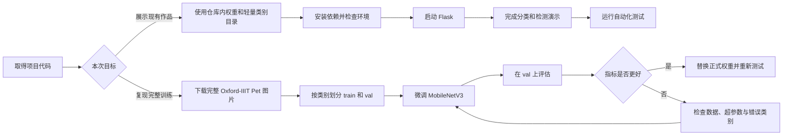
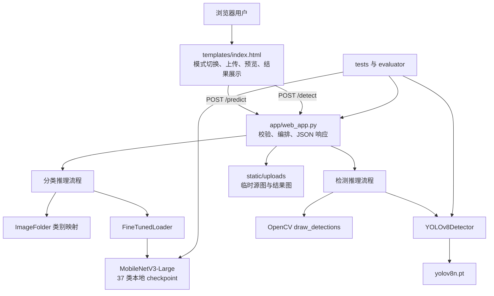
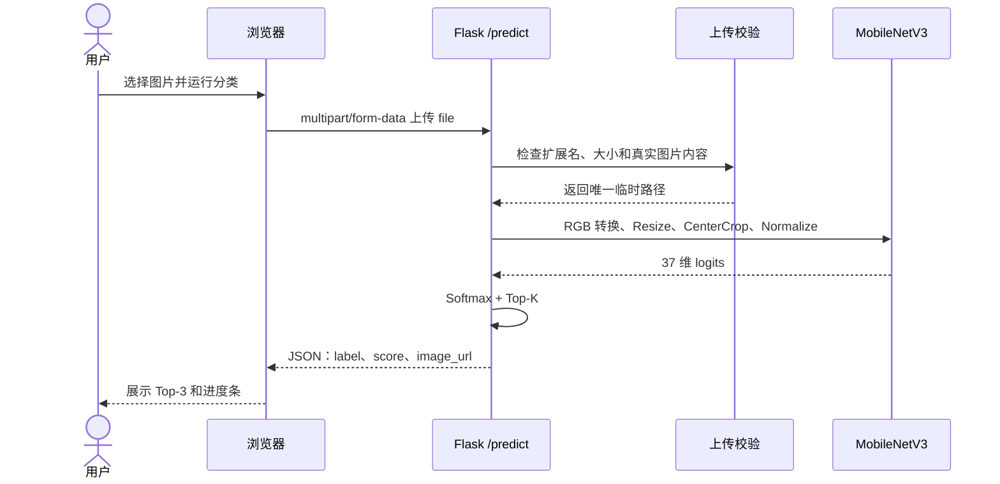
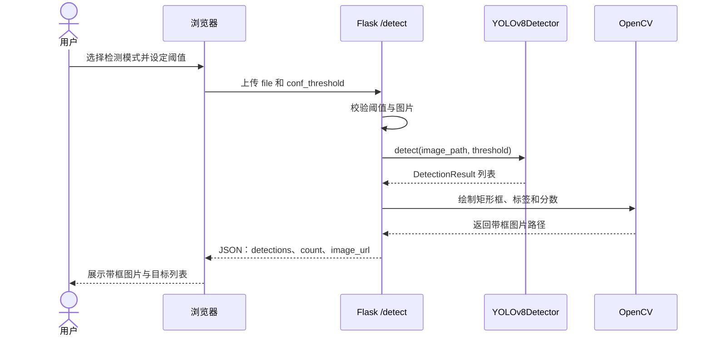
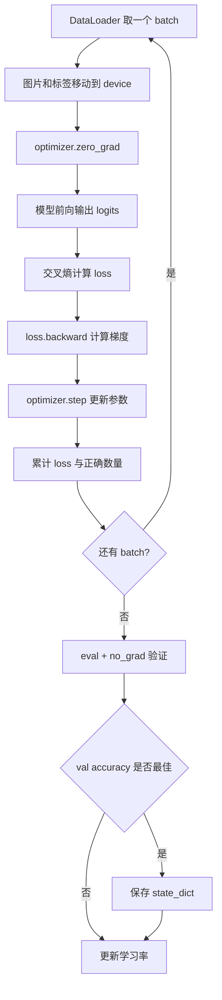
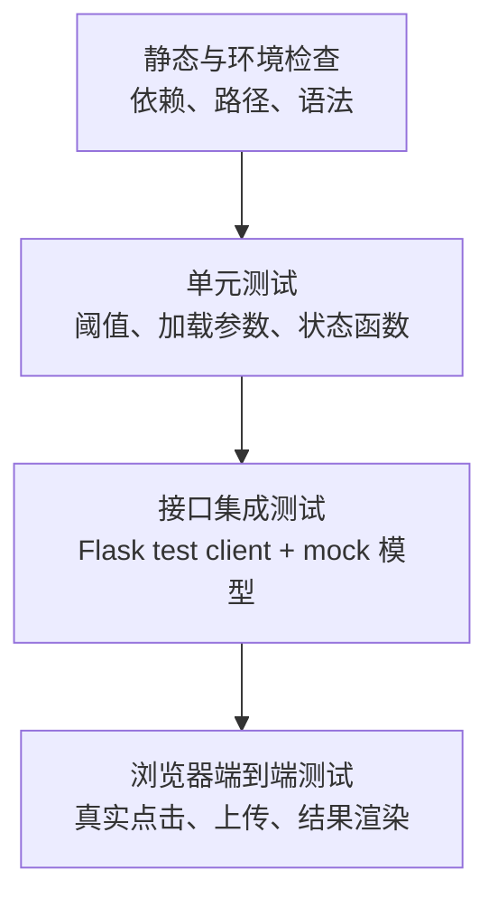
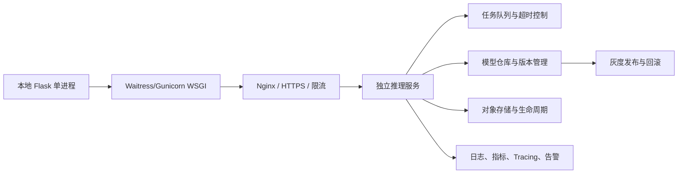

# AI Image Recognition 项目作品集实操手册

> 文档定位：面向第一次接触深度学习工程、需要独立复现并展示作品的学习者。
>
> 适用项目：`Wing-Chen0731/AI-Image-Recognition`
>
> 当前能力：Oxford-IIIT Pet 37 类宠物品种分类、YOLOv8n 通用目标检测、OpenCV 检测结果可视化、Flask Web 交互、自动化测试与模型评估。
>
> 文档版本：以 Git 提交 `fde545d` 及之后的当前代码为准。

---

## 目录

1. 手册目标与阅读方式
2. 项目能力、边界与交付标准
3. 系统组成与运行原理
4. 开始前的软硬件准备
5. 获取代码与确认目录
6. 创建并激活 Conda 环境
7. 安装依赖与环境验收
8. 快速启动 Web 系统
9. 图像分类完整实操
10. 目标检测完整实操
11. 置信度阈值对照实验
12. 数据集下载与划分
13. MobileNetV3 微调实操
14. 分类模型评估与结果解释
15. 接口、单元和集成测试
16. 文件、配置和运行产物管理
17. 常见故障诊断手册
18. 面试现场演示标准流程
19. 从课堂作品升级到生产系统
20. 最终验收清单与实验记录模板

---

## 一、手册目标与阅读方式

### 1.1 这份手册解决什么问题

很多初学者能够运行一条 `python` 命令，却无法解释命令之前需要准备什么、命令执行期间发生了什么、执行结果怎样才算正确、报错时应该先检查哪一层。本手册不是简单的命令列表，而是一份从环境准备到面试展示的完整操作规程。完成全部步骤后，操作者应当能够做到以下几点：

1. 在 Windows 或 macOS 上创建独立的 Conda 环境并安装项目依赖。
2. 解释 `requirements.txt`、模型权重、数据集、Python 代码和 Web 页面之间的关系。
3. 独立启动 Flask 应用，完成分类与检测两条业务流程。
4. 理解 Top-3、Softmax、检测框、类别、置信度阈值的含义。
5. 下载完整 Oxford-IIIT Pet 图片集，按类别划分 `train` 和 `val`。
6. 继续微调 MobileNetV3，并用独立验证集评估模型。
7. 运行自动化测试，判断系统是否达到可交付状态。
8. 在面试中准确说明哪些模型由项目训练，哪些模型直接使用预训练权重。
9. 识别当前系统的能力边界，不把宠物品种分类错误表述为毛色分类。

### 1.2 推荐阅读顺序

如果只需要在课堂或面试中演示现有成品，按第 4 至第 11 章操作即可。仓库已经包含轻量类别目录、MobileNetV3 分类权重和 `yolov8n.pt`，不需要先训练模型。

如果需要从原始数据开始复现训练过程，应继续完成第 12 至第 14 章。完整数据不随 Git 仓库提交，因此需要单独下载。

如果需要提交作业、做项目验收或排查问题，应重点阅读第 15 至第 20 章。每一章都提供“通过标准”，不要只以“终端没有红字”作为成功依据。

### 1.3 两条实操路线



---

## 二、项目能力、边界与交付标准

### 2.1 项目一句话定义

这是一个把图像分类模型和目标检测模型集成到同一 Flask Web 应用中的计算机视觉作品。用户上传一张图片后，可以选择“图像分类”查看宠物品种 Top-3，也可以选择“目标检测”查看图片中通用物体的位置、类别和置信度。

### 2.2 系统具备的能力

分类模块使用微调后的 MobileNetV3-Large。输入是一张图片，输出是 Oxford-IIIT Pet 37 个已知宠物品种中的概率排序。当前权重在 1,478 张验证图片上得到 90.19% Top-1 accuracy，即 1,333 张预测正确。

检测模块使用 Ultralytics YOLOv8n 的通用预训练权重。输入是一张图片，输出可能包含零个、一个或多个目标。每个目标包含类别名称、置信度以及矩形框的左上角和右下角坐标。OpenCV 根据这些结构化结果绘制边界框、文字和分数，并保存一张新的结果图片。

Web 模块使用 Flask 提供三个主要路由：

- `GET /`：返回操作页面和资源状态。
- `POST /predict`：接收图片并返回分类 JSON。
- `POST /detect`：接收图片和阈值并返回检测 JSON 及带框图片地址。

### 2.3 必须明确的能力边界

Oxford-IIIT Pet 的标签是 37 个猫狗品种，不包含“金渐层、银渐层、蓝猫”这样的独立毛色标签。因此当前 MobileNetV3 不能被描述为可靠的毛色分类器。即使输入一张金渐层照片，模型也只会在它知道的 37 个品种中选择一个结果。

第七课没有重新训练 YOLO。`yolov8n.pt` 是通用预训练检测权重，本项目完成的是模型集成、阈值控制、结果标准化、OpenCV 绘制以及 Web 闭环。如果要检测自定义宠物品种，需要为图片绘制边界框并重新训练检测模型。

Softmax 分数和 YOLO 置信度都不是“百分之百可信的概率保证”。它们是模型输出的相对可信程度，模型可能对错误答案给出较高分数。因此作品展示必须同时讲准确率、数据范围和失败案例。

### 2.4 专业交付标准

一次完整交付至少应满足：

- 使用独立 Conda 环境，不依赖无法说明来源的全局 Python 包。
- `python tests/test_env.py` 输出 `Environment check passed.`。
- 首页可打开，分类与检测接口均能返回成功结果。
- 错误文件、空文件、超大文件不会让 Flask 直接崩溃。
- 模型权重和类别映射一致。
- 自动化测试全部通过。
- 模型指标有明确评估数据和复现命令。
- 文档明确区分分类、检测、预训练和微调。
- 临时上传文件受到数量和时间限制。
- Git 仓库不包含 Conda 环境、缓存、个人路径和完整大数据集。

---

## 三、系统组成与运行原理

### 3.1 分层架构



### 3.2 一张图片如何完成分类



分类前处理必须与验证阶段一致：图片转换为 RGB，短边缩放到 256，中心裁剪为 224×224，转换成 Tensor，再使用 ImageNet mean 和 std 做归一化。预处理不一致会造成输入分布偏移，即使权重文件完全正确，预测质量也可能下降。

### 3.3 一张图片如何完成检测



### 3.4 核心目录的职责

```text
AI-Image-Recognition/
├─ app/                         Python 业务代码
│  ├─ web_app.py               Flask 入口、路由、上传与流程编排
│  ├─ model_loader.py           分类模型结构和权重加载
│  ├─ object_detector.py        检测接口、YOLO 实现、结果值对象
│  ├─ preprocess.py             OpenCV 检测结果绘制
│  ├─ finetune.py               MobileNetV3 完整微调脚本
│  ├─ dataset.py                Dataset、DataLoader 和策略示例
│  └─ transforms.py             训练与验证预处理
├─ data/oxford_pet_split/       ImageFolder 格式的数据目录
├─ models/                      分类 checkpoint
├─ scripts/                     数据划分、评估和文档构建脚本
├─ static/uploads/              Web 临时图片目录
├─ templates/index.html         页面结构、样式与交互逻辑
├─ tests/                       环境、模型加载、Web 接口测试
├─ yolov8n.pt                   YOLOv8n 检测权重
├─ requirements.txt             Python 依赖清单
├─ MODEL_CARD.md                分类模型卡
└─ README.md                    项目入口说明
```

---

## 四、开始前的软硬件准备

### 4.1 最低软件要求

建议安装以下软件：

1. Git，用于克隆和更新仓库。
2. Miniconda 或 Anaconda，用于隔离 Python 环境。
3. VS Code，用于阅读代码和使用终端。
4. Chrome、Edge 或 Safari，用于访问本地 Web 页面。
5. 足够的磁盘空间。仅运行成品需要的空间较小；下载并解压完整数据、保留压缩包和划分副本时，建议至少预留 4 GB。

推荐 Python 3.10 或 3.11。不要把“电脑安装过 Python”当成环境已经正确，关键是当前终端中的 `python` 必须来自准备好的 Conda 环境。

### 4.2 CPU 与 GPU

现有 Web 推理可以在 CPU 上运行，不要求 NVIDIA 显卡。CPU 第一次加载模型和第一次推理会较慢，这是正常现象。

完整微调建议使用支持 CUDA 的 NVIDIA GPU。macOS 没有 CUDA，但 PyTorch 可以在部分 Apple Silicon 机器上使用 MPS；当前训练脚本只自动选择 CUDA 或 CPU，因此 macOS 默认会使用 CPU。若需要正式支持 MPS，应在代码中增加设备选择并重新验证算子兼容性，不能只把字符串改为 `mps` 后假定所有流程都正确。

### 4.3 网络要求

第一次安装依赖必须联网。仓库已包含正式分类权重和 `yolov8n.pt` 时，安装完成后的演示可以离线运行。分类推理构建 MobileNetV3 时使用 `weights=None`，随后加载完整本地 checkpoint，不会再次下载 ImageNet 权重。

重新训练且不是从本地 checkpoint 继续时，TorchVision 可能需要下载 ImageNet 预训练权重。下载完整 Oxford-IIIT Pet 数据也需要网络。

---

## 五、获取代码与确认目录

### 5.1 克隆仓库

打开 Conda Prompt、PowerShell、Windows Terminal 或 macOS Terminal，执行：

```bash
git clone https://github.com/Wing-Chen0731/AI-Image-Recognition.git
cd AI-Image-Recognition
```

如果已经克隆过，不要再次创建一层同名目录。进入原项目后执行：

```bash
git pull origin main
```

**通过标准：** 当前目录中能看到 `app`、`templates`、`tests`、`requirements.txt`、`yolov8n.pt` 等内容。

### 5.2 确认自己位于项目根目录

Windows PowerShell：

```powershell
Get-Location
Test-Path requirements.txt
Test-Path app/web_app.py
```

macOS 或 Git Bash：

```bash
pwd
test -f requirements.txt && echo OK
test -f app/web_app.py && echo OK
```

后两项必须为 `True` 或输出 `OK`。如果找不到 `requirements.txt`，后续命令会失败。常见原因是终端仍停留在用户主目录，或者进入了项目外层目录而不是仓库根目录。

### 5.3 检查关键运行资产

跨平台 Python 检查：

```bash
python -c "from pathlib import Path; print('classifier:', Path('models/oxford_pet_mobilenet_epoch1.pth').is_file()); print('detector:', Path('yolov8n.pt').is_file()); print('classes:', len([p for p in Path('data/oxford_pet_split/train').iterdir() if p.is_dir()]))"
```

预期看到分类权重为 `True`、检测权重为 `True`、类别目录数量为 `37`。仓库中的每个类别只保留少量代表图片，目的是让 `ImageFolder` 恢复正确的类别顺序并让 Web 成品可以运行，而不是让同学用这些少量图片重新训练。

---

## 六、创建并激活 Conda 环境

### 6.1 为什么必须使用独立环境

不同项目可能要求不同版本的 PyTorch、TorchVision、Flask 和 OpenCV。把所有库安装到 `base` 或系统 Python 中，会出现一个项目升级依赖后破坏另一个项目的情况。Conda 环境相当于为项目准备一个独立工具箱，环境中的 Python 和包版本不会轻易影响系统其他项目。

### 6.2 创建环境

```bash
conda create -n pytorch_env python=3.11 -y
conda activate pytorch_env
```

如果环境已经存在，只执行：

```bash
conda activate pytorch_env
```

环境名称可以不同，但后续所有安装和运行命令必须在同一个环境中完成。

### 6.3 确认环境真的生效

```bash
python --version
python -c "import sys; print(sys.executable)"
```

Windows 的路径通常类似：

```text
C:\Users\用户名\miniconda3\envs\pytorch_env\python.exe
```

macOS 的路径通常类似：

```text
/Users/用户名/miniconda3/envs/pytorch_env/bin/python
```

如果路径中仍然是 `base`、系统 Python 或其他环境，应先停止安装依赖，重新执行 `conda activate pytorch_env`。VS Code 右下角的“创建环境”提醒可以关闭，只要终端和 Python 解释器都已经指向正确的 Conda 环境，不需要重复创建。

### 6.4 VS Code 解释器选择

按 `Ctrl+Shift+P`，macOS 使用 `Command+Shift+P`，输入 `Python: Select Interpreter`，选择路径中包含 `pytorch_env` 的解释器。这个选择影响 VS Code 的运行按钮、代码提示和测试插件；终端中的 `conda activate` 则影响终端命令。两者最好保持一致。

---

## 七、安装依赖与环境验收

### 7.1 安装命令

```bash
python -m pip install --upgrade pip
python -m pip install -r requirements.txt
```

推荐使用 `python -m pip`，因为它明确表示“使用当前这个 Python 对应的 pip”。单独输入 `pip` 时，如果 PATH 配置混乱，可能把包安装到另一个 Python 环境。

`requirements.txt` 不是运行程序，而是一份依赖清单。pip 读取每一行，根据版本范围安装 PyTorch、TorchVision、Pillow、Flask、Ultralytics、OpenCV、Requests 和 tqdm。看到 `Requirement already satisfied` 表示当前环境已经有符合要求的版本，不是错误。

### 7.2 执行项目环境检查

```bash
python tests/test_env.py
```

**通过标准：** 最后一行出现：

```text
Environment check passed.
```

环境检查的价值在于提前发现“依赖装在 A 环境，程序却由 B 环境运行”这类问题。若提示某个模块缺失，先确认 `sys.executable`，再在同一个终端重新安装依赖。

### 7.3 手工查看关键库版本

```bash
python -c "from importlib.metadata import version; import torch, torchvision, cv2, ultralytics; print('torch', torch.__version__); print('torchvision', torchvision.__version__); print('flask', version('Flask')); print('opencv', cv2.__version__); print('ultralytics', ultralytics.__version__); print('cuda', torch.cuda.is_available())"
```

版本号不需要与老师电脑逐位相同，只要满足 `requirements.txt` 的范围并通过测试即可。`cuda False` 只表示当前 PyTorch 不能使用 NVIDIA CUDA，不代表项目无法在 CPU 上运行。

### 7.4 Ultralytics 配置目录

检测器初始化时会把 `YOLO_CONFIG_DIR` 指向项目中的 `.ultralytics`，让 Ultralytics 将 `settings.json` 等运行配置写入项目可控目录。这样可以避免某些电脑的用户配置目录无写入权限。代码还设置 `YOLO_AUTOINSTALL=false`，防止一次 Web 请求在后台偷偷执行 pip。依赖应当在启动前由操作者明确安装。

---

## 八、快速启动 Web 系统

### 8.1 启动命令

确认终端位于项目根目录并已激活环境：

```bash
python app/web_app.py
```

预期输出包含：

```text
* Serving Flask app 'web_app'
* Running on http://127.0.0.1:5000
```

浏览器访问：

```text
http://127.0.0.1:5000/
```

### 8.2 Development server warning 是否需要处理

终端中的以下警告是 Flask 的正常提示：

```text
WARNING: This is a development server. Do not use it in a production deployment.
```

在本机课堂实验、个人作品演示和开发调试中不需要消除。它不是依赖错误，也不会影响分类和检测。它提醒开发者不要把 Flask 内置服务器直接暴露到公网。如果部署给真实用户，应改用 Waitress、Gunicorn 或其他 WSGI 服务器，并增加反向代理、日志、限流、认证和监控。

### 8.3 修改端口

如果 5000 端口已被占用：

```bash
python app/web_app.py --port 5001
```

然后访问 `http://127.0.0.1:5001/`。`--host 127.0.0.1` 只允许本机访问；不要为了方便随意改为 `0.0.0.0` 后接入公共网络。

### 8.4 正确停止服务

回到运行 Flask 的终端，按 `Ctrl+C`。不要直接关闭电脑或反复启动多个服务，否则可能产生多个 Python 进程并占用不同端口。

---

## 九、图像分类完整实操

### 9.1 操作目标

验证浏览器、Flask、图片校验、MobileNetV3、本地 checkpoint、类别映射和前端结果展示能够形成闭环。

### 9.2 标准步骤

1. 打开首页，确认资源概览没有显示分类模型缺失。
2. 选择“图像分类”标签。
3. 点击“选择图片”，或把 JPG、PNG、BMP、WEBP 图片拖入上传区。
4. 确认页面显示文件名、大小和原图预览。
5. 等待状态从处理中变为识别完成。
6. 查看结果面板中的 Top-3 类别、分数和进度条。
7. 点击“重新运行”，确认同一图片可以再次请求。
8. 点击“清空”，确认预览、结果和文件状态恢复初始状态。

### 9.3 分类结果怎样理解

Top-1 是 37 个类别中 Softmax 分数最高的类别。Top-3 是分数最高的三个候选。Top-3 不是三个物体，也不是说图片中同时存在三个品种；它表达模型对整张图片类别的前三个候选判断。

如果模型实际只有两个输出类别，那么 `topk=min(3, 类别数)` 最多返回两个结果。网页要求 Top-3 不会凭空增加模型没学过的类别。

### 9.4 分类内部发生了什么

```text
浏览器选择文件
-> POST /predict
-> 文件名和扩展名校验
-> Pillow 验证真实图片内容
-> 保存为 UUID 唯一文件名
-> 按验证预处理生成 [1, 3, 224, 224] Tensor
-> 首次请求加载 MobileNetV3 与本地 checkpoint
-> torch.no_grad() 前向推理
-> 37 维 logits 经过 softmax
-> 取分数最高的最多 3 类
-> 返回 JSON
-> 页面构建结果列表
```

### 9.5 通过标准

- 页面没有停留在无限加载状态。
- 浏览器能够显示上传图片。
- 结果数量为 1 至 3，当前 37 类模型通常显示 3 项。
- 每一项包含类别名和 0 至 100 的分数。
- Flask 终端没有未处理 traceback。
- 网络请求 `/predict` 返回 HTTP 200。

### 9.6 负向测试

尝试选择 `.txt` 文件，前端应拒绝或后端返回 400。将文本文件后缀改成 `.jpg`，后端仍应通过 Pillow 内容验证识别它不是有效图片。上传超过 16 MB 的文件时，应返回 413 和“图片不能超过 16 MB”，而不是出现 500 页面。

---

## 十、目标检测完整实操

### 10.1 操作目标

验证 YOLOv8n、每次请求的阈值、`DetectionResult`、OpenCV 绘图、静态文件访问和前端目标列表能够形成闭环。

### 10.2 标准步骤

1. 在首页选择“目标检测”。
2. 选择一张包含常见物体的图片，例如人、猫、狗、汽车或杯子。
3. 保持默认阈值 0.5，上传并等待结果。
4. 查看结果图片中的绿色边界框、标签和分数。
5. 查看结果面板的目标数量以及每个目标的类别和置信度。
6. 将滑块改为 0.3，重新运行。
7. 将滑块改为 0.7，再次运行。
8. 对比三次结果的框数量和低分目标变化。

### 10.3 YOLO 与 OpenCV 的职责

YOLO 负责识别：它根据像素推理目标类别、置信度和坐标。OpenCV 负责后处理：它读取原图，把坐标转换成可画的整数范围，绘制矩形、文字背景、标签和分数，再用 `cv2.imwrite` 保存结果图。

如果没有 YOLO，OpenCV 不知道哪里有猫；如果没有 OpenCV，系统仍然可以返回坐标 JSON，但用户看不到直观的带框图片。两者合作，但职责不同。

### 10.4 为什么首次检测更慢

`get_detector()` 使用全局缓存。第一次检测会导入 Ultralytics、创建网络并读取 `yolov8n.pt`；后续请求复用同一个模型对象，只改变本次请求的阈值。首次延迟大于后续延迟是预期行为。

### 10.5 没有检测框是不是错误

不一定。可能原因包括：图片中没有 COCO 预训练类别、目标太小或模糊、阈值过高、角度和场景与训练分布差异较大。接口返回空 `detections` 和 `count: 0` 仍然是一次成功请求，不应当返回 500。

### 10.6 通过标准

- `/detect` 返回 HTTP 200。
- JSON 中有 `detections`、`count`、`image_url` 和 `conf_threshold`。
- `count` 与检测列表长度一致。
- 带框结果图片可以打开。
- 阈值变化不会重新下载或重新创建模型。
- 坐标不会画到图片尺寸之外。

---

## 十一、置信度阈值对照实验

### 11.1 实验目的

理解推理参数与训练参数的区别。置信度阈值不修改 YOLO 权重，不触发训练，只决定本次请求保留哪些候选框。

### 11.2 控制变量方法

必须使用同一张图片，只改变阈值。推荐记录：

| 实验编号 | 阈值 | 检测数量 | 主要类别 | 明显误检 | 明显漏检 |
| --- | ---: | ---: | --- | --- | --- |
| A | 0.3 | 待填写 | 待填写 | 待填写 | 待填写 |
| B | 0.5 | 待填写 | 待填写 | 待填写 | 待填写 |
| C | 0.7 | 待填写 | 待填写 | 待填写 | 待填写 |

通常阈值从 0.3 提高到 0.7 后，保留框数量不增加。低阈值更偏向召回，可能保留更多正确目标，也可能增加误检；高阈值更严格，结果更简洁，但可能漏掉困难目标。不能只根据一张图片宣布某个阈值“最好”，业务阈值应在代表性验证集上选择。

### 11.3 默认值与请求值的关系

`YOLOv8Detector.__init__` 中的 0.5 是调用者没有提供阈值时的默认值。网页滑块会将用户选择值通过表单字段 `conf_threshold` 发送给 `/detect`，后端验证其范围后传给 `detector.detect()`。因此“类中有默认值”和“Web 可以改变阈值”并不冲突：默认值提供可用基线，请求值覆盖本次调用。

---

## 十二、数据集下载与划分

### 12.1 什么时候需要完整数据

只演示现有 Web 不需要完整数据。重新微调或运行完整 1,478 张验证集评估时，需要本地完整 `train` 和 `val`。Git 仓库只提交每类少量图片，不适合作为正式训练集。

Oxford 官方数据页为 `https://www.robots.ox.ac.uk/~vgg/data/pets/`，原图压缩包为 `https://www.robots.ox.ac.uk/~vgg/data/pets/data/images.tar.gz`。该数据集有 37 类，每类大约 200 张图片。当前分类划分脚本只依赖图片文件名中的类别，不需要 `annotations.tar.gz`。只有在进行官方划分、边界框、头部区域或像素分割任务时，才需要 annotations。

### 12.2 推荐目录

```text
data/
├─ images/                    解压后的原始图片，全部平铺
└─ oxford_pet_split/
   ├─ train/
   │  ├─ Abyssinian/
   │  ├─ Bengal/
   │  └─ ...共 37 类
   └─ val/
      ├─ Abyssinian/
      ├─ Bengal/
      └─ ...共 37 类
```

### 12.3 解压

Windows 可以使用 7-Zip 解压 `images.tar.gz`，最终确保路径是 `data/images/Abyssinian_1.jpg`，而不是多套一层 `data/images/images/Abyssinian_1.jpg`。

macOS 或 Linux 可以执行：

```bash
tar -xzf images.tar.gz -C data
```

### 12.4 运行分层划分脚本

如果 `data/oxford_pet_split` 已存在，先确认里面是否有需要保留的数据。以下命令带 `--overwrite`，会重建输出目录：

```bash
python scripts/split_oxford_pet.py --images-dir data/images --output-dir data/oxford_pet_split --val-ratio 0.2 --seed 42 --overwrite
```

各参数含义：

- `--images-dir`：原始平铺图片目录。
- `--output-dir`：生成的 ImageFolder 根目录。
- `--val-ratio 0.2`：每个类别约 20% 分到验证集。
- `--seed 42`：固定随机顺序，使同样输入得到可复现划分。
- `--overwrite`：允许删除并重建输出目录，使用前必须确认路径。

脚本从文件名末尾去掉 `_数字` 得到类别，例如 `British_Shorthair_10.jpg` 解析为 `British_Shorthair`。然后每个类别单独打乱并按比例划分，因此它是按类别分层划分，不会让小类别偶然全部进入同一 split。

### 12.5 数据验收

```bash
python -c "from torchvision.datasets import ImageFolder; tr=ImageFolder('data/oxford_pet_split/train'); va=ImageFolder('data/oxford_pet_split/val'); print(len(tr), len(va), len(tr.classes)); print(tr.class_to_idx == va.class_to_idx)"
```

本项目完整划分预期为训练 5,912 张、验证 1,478 张、37 类，最后的映射比较应为 `True`。如果 train 和 val 类别映射不同，不能继续训练或评估，因为同一个数字标签可能代表不同品种。

### 12.6 为什么不把验证集拿来训练

训练集用于更新权重，验证集用于在未参与梯度更新的数据上估计泛化能力。如果模型反复根据验证集结果调整超参数，验证集也会逐渐参与决策。更严格的项目还应保留独立 test 集，在所有设计决定结束后只评估一次。

---

## 十三、MobileNetV3 微调实操

### 13.1 训练前检查

确认完整数据已经划分，确认输出文件不会覆盖仍需保留的正式模型，并记录当前 Git commit、Python 版本、GPU、参数和随机种子。训练不是只看最终一个数字，专业实验必须能够追溯条件。

### 13.2 首次迁移学习

下面命令从 ImageNet 预训练 MobileNetV3 开始，默认冻结特征提取层，只训练替换后的 37 类分类头：

```bash
python app/finetune.py --data-dir data/oxford_pet_split --epochs 3 --batch-size 16 --num-workers 0 --output models/experiment_head_only.pth
```

第一次运行可能下载 TorchVision ImageNet 权重。`num-workers 0` 对 Windows 和课堂环境更稳定；提高 worker 数量前应单独测试。

### 13.3 全模型继续微调

在已有 checkpoint 基础上使用较小学习率解冻特征层：

```bash
python app/finetune.py --data-dir data/oxford_pet_split --epochs 3 --batch-size 32 --num-workers 0 --lr 0.0001 --weight-decay 0.0001 --label-smoothing 0.1 --unfreeze-features --resume models/oxford_pet_mobilenet_epoch1.pth --output models/oxford_pet_mobilenet_candidate.pth
```

参数解释：

- `--epochs 3`：完整遍历训练集三次。
- `--batch-size 32`：一次前向和反向处理 32 张图，显存不足时改为 16 或 8。
- `--lr 0.0001`：全模型微调使用较小步长，降低破坏已有特征的风险。
- `--weight-decay 0.0001`：AdamW 的权重衰减，用于约束过拟合。
- `--label-smoothing 0.1`：目标分布不使用绝对 one-hot，降低过度自信。
- `--unfreeze-features`：允许更新特征提取部分。
- `--resume`：先加载现有完整 checkpoint，不再下载 ImageNet 权重。
- `--output`：保存验证准确率最佳的候选权重。

### 13.4 一个 epoch 内部的训练循环



### 13.5 如何观察训练输出

每个 epoch 会输出训练 loss、训练 accuracy、验证 loss 和验证 accuracy。理想情况下训练 loss 下降，验证准确率上升并逐渐稳定。以下情况需要调查：

- 训练和验证准确率都很低：数据标签、类别数、学习率、预处理或权重加载可能有问题。
- 训练准确率持续上升而验证准确率下降：可能过拟合。
- loss 出现 `nan`：学习率过大、输入异常或数值不稳定。
- GPU 显存不足：降低 batch size，关闭其他占用显存的程序。
- 每轮结果完全不变：检查参数是否被冻结、优化器是否收到可训练参数。

### 13.6 不要直接覆盖正式权重

新实验先保存为 `candidate.pth`，评估优于正式模型且 Web 回归通过后，再替换 `models/oxford_pet_mobilenet_epoch1.pth`。保留实验参数和指标，避免只凭一张示例图片决定模型好坏。

---

## 十四、分类模型评估与结果解释

### 14.1 运行评估器

```bash
python scripts/evaluate_classifier.py --data-dir data/oxford_pet_split --model models/oxford_pet_mobilenet_epoch1.pth --batch-size 64 --num-workers 0
```

如果没有 CUDA 或希望强制 CPU：

```bash
python scripts/evaluate_classifier.py --device cpu
```

### 14.2 当前基准结果

```text
Validation samples: 1478
Top-1 accuracy: 90.19% (1333/1478)
```

当前模型相对旧课堂权重从 81.46% 提高到 90.19%，增加 8.73 个百分点。这个说法是“百分点”，不是简单说“提升 8.73%”，因为两个百分比直接相减得到的是百分点差。

### 14.3 最弱类别的意义

评估器会打印准确率最低的五个类别，例如 American Pit Bull Terrier、Ragdoll 等。总体 90.19% 不代表每个类别都是 90.19%。宏观指标可能掩盖某些困难类别，因此下一步应增加混淆矩阵，查看它们常被错分成谁，再结合样本质量判断是视觉相似、数据不足还是标签问题。

### 14.4 为什么单张图片不能证明模型质量

一张图预测正确可能只是容易样本；一张图预测错误也不代表整体模型不可用。模型选择应依据固定验证集上的整体指标、分类型指标和失败样本分析。展示时可以用单张图说明交互流程，但不能把演示样本结果代替正式评估。

### 14.5 数据泄漏检查

如果相同图片、近重复图片或同一来源连续照片同时出现在 train 和 val，评估可能虚高。专业升级应计算图片哈希、感知哈希或用特征相似度查重，并保存 split 清单。任何根据验证图片手工移动样本以提高分数的操作都会污染评估。

---

## 十五、接口、单元和集成测试

### 15.1 自动化测试命令

在项目根目录执行：

```bash
python -m unittest discover -s tests -p "test_*.py"
```

当前预期结果为 9 项测试通过：

```text
Ran 9 tests
OK
```

在 PowerShell 遇到 Ultralytics 用户配置目录权限问题时，可先将配置目录显式设为项目目录：

```powershell
$env:YOLO_CONFIG_DIR=(Resolve-Path '.ultralytics').Path
python -m unittest discover -s tests -p 'test_*.py'
```

macOS 或 Git Bash：

```bash
export YOLO_CONFIG_DIR="$PWD/.ultralytics"
python -m unittest discover -s tests -p 'test_*.py'
```

### 15.2 测试分层



单元测试数量多、速度快，用于定位局部逻辑；接口测试验证模块之间的契约；浏览器测试验证用户真实操作。不能只做其中一种。Mock 测试可以稳定验证 HTTP 状态和 JSON 结构，但不能证明真实权重一定能成功推理，因此还需要真实模型冒烟测试。

### 15.3 手工接口测试

PowerShell 分类示例：

```powershell
curl.exe -X POST -F "file=@images/cat.jpg" http://127.0.0.1:5000/predict
```

检测示例：

```powershell
curl.exe -X POST -F "file=@images/cat.jpg" -F "conf_threshold=0.5" http://127.0.0.1:5000/detect
```

macOS 与 Linux 的 `curl` 参数相同。成功分类 JSON 应有 `results`，成功检测 JSON 应有 `detections` 和 `count`。不要只看 HTTP 200，还要检查字段类型、数量和图片 URL 是否能访问。

### 15.4 回归测试顺序

每次修改模型加载、路由、模板或依赖后，建议按以下顺序：

1. 运行环境检查。
2. 运行 9 项自动化测试。
3. 启动 Flask，访问首页。
4. 用真实图片调用分类。
5. 用真实图片调用检测。
6. 测试 0.3、0.5、0.7 阈值。
7. 测试错误文件和超大文件。
8. 查看浏览器 Console 是否有 JavaScript 错误。
9. 检查 `static/uploads` 是否持续无限增长。

---

## 十六、文件、配置和运行产物管理

### 16.1 模型权重

`.pth` 和 `.pt` 都可能是 PyTorch 相关文件，但具体内容取决于保存方式。分类文件保存 MobileNetV3 的 `state_dict`；检测文件由 Ultralytics 读取。不能仅根据扩展名互换加载器。

分类 checkpoint 与类别数必须匹配。当前分类头输出 37 维，`ImageFolder` 从按字母排序的 37 个目录得到 `class_to_idx`。若删除、增加或重命名类别目录，模型输出索引和页面标签可能错位。

### 16.2 Path 与 str

`Path` 是 Python 的路径对象，适合 `/` 拼接、`exists()`、`is_file()`、`stem` 和 `suffix` 等操作。`str` 是普通文本。项目内部优先使用 `Path` 表达“这是路径”；传给某些环境变量、OpenCV、Ultralytics、Flask 配置或 JSON 时，根据对方 API 要求转换成 `str(path)`。

### 16.3 上传文件生命周期

上传文件使用 UUID 前缀，避免不同用户上传同名文件时互相覆盖。分类保留源图供页面预览；检测额外生成 `_detected` 结果图。应用启动和请求时会清理超过 24 小时的文件，并只保留最多 100 个较新的文件。删除失败会记录调试日志而不让整个请求崩溃。

### 16.4 不应提交到 Git 的内容

- `__pycache__`、`.pyc`、IDE 缓存。
- Conda 环境目录和 `site-packages`。
- 用户上传的临时图片。
- 完整 1.5 GB 左右的本地工作数据副本。
- 旧实验 checkpoint 和备份权重。
- API 密钥、账号、绝对个人路径。
- 未确认许可证的大规模第三方数据。

正式需要分发大模型时，可以使用 Git LFS、Release asset、对象存储或模型仓库，并在 README 中提供校验哈希和下载脚本。

---

## 十七、常见故障诊断手册

### 17.1 `TemplateNotFound: index.html`

原因通常是 Flask 默认按启动位置寻找模板，而程序从 `app/web_app.py` 启动。当前代码使用由 `__file__` 计算出的项目根目录，显式设置 `template_folder` 和 `static_folder`，因此不依赖当前工作目录。

检查：

```bash
python -c "from pathlib import Path; print(Path('templates/index.html').resolve(), Path('templates/index.html').is_file())"
```

若文件确实缺失，重新 `git pull`；不要在 `app` 中复制一份模板制造两个版本。

### 17.2 `No fine-tuned checkpoint found`

检查：

```bash
python -c "from pathlib import Path; print(Path('models/oxford_pet_mobilenet_epoch1.pth').is_file())"
```

若为 `False`，从仓库恢复模型文件，或把训练生成的 checkpoint 放到该路径。只创建一个空文件不能解决问题，加载时会因权重格式错误失败。

### 17.3 数据路径只有 `data/train` 和 `data/val`

当前 `resolve_data_root()` 兼容两种结构：优先 `data/oxford_pet_split/train`，找不到时检查 `data/train`。因此不需要为了名字机械移动数据。关键是 train 下面必须直接包含类别子目录，而不是图片全部平铺。

### 17.4 页面 500 Internal Server Error

浏览器的 500 页面只是结果，不是根因。回到启动 Flask 的终端，从 traceback 最后一行向上查看。常见根因有模板缺失、模型缺失、类别数不匹配、图片损坏和依赖未安装。当前已知错误会转换为 400、413 或 503，并隐藏敏感内部路径；真正未预期异常才返回通用 500。

### 17.5 `ModuleNotFoundError`

先执行：

```bash
python -c "import sys; print(sys.executable)"
python -m pip show flask torch torchvision ultralytics opencv-python
```

如果 `pip show` 找不到包，确认激活环境后重新安装。不要在报错终端之外另开一个未激活的终端安装。

### 17.6 Windows PowerShell 禁止运行 `profile.ps1`

这是 PowerShell 执行策略与个人 profile 的问题，不是 PyTorch 或 Flask 代码错误。可以在确认学校或组织策略允许的前提下，为当前用户设置：

```powershell
Set-ExecutionPolicy -Scope CurrentUser RemoteSigned
```

也可以使用 Anaconda Prompt 或 Git Bash 运行项目。不要使用全局 `Unrestricted` 作为默认解决方案。

### 17.7 Ultralytics `settings.json` 权限错误

当前检测器会把配置写入项目 `.ultralytics`。测试在导入项目代码之前如果先导入了 Ultralytics，可手工设置 `YOLO_CONFIG_DIR`，具体命令见第 15.1 节。确认 `.ultralytics` 目录可写。

### 17.8 端口被占用

Windows：

```powershell
Get-NetTCPConnection -LocalPort 5000 -ErrorAction SilentlyContinue
```

可以停止旧 Flask 进程，或使用 `--port 5001`。不要盲目结束所有 Python 进程，因为其中可能有其他工作。

### 17.9 预测只有 cat 和 dog

检查训练目录。如果模型训练时只有 `train/cat` 和 `train/dog`，分类头只有两个输出，因此 Top-3 最多显示两个。网页展示策略不能突破模型类别数。要获得 37 类结果，必须使用 37 类目录和匹配的 37 类 checkpoint。

### 17.10 输入猪图片却预测成狗或猫品种

这是封闭集分类器的预期限制。模型没有“未知”类别，Softmax 必须把分数分配到已知 37 类。改进方式包括增加其他类或 unknown 数据、训练开放集识别策略、设置经验证的拒识规则，或先用检测器判断是否为猫狗再进入品种分类。不能简单把最高分低于任意阈值就称为科学的 unknown 检测，阈值需要专门验证。

### 17.11 检测模型为何自动出现

当代码执行 `YOLO('yolov8n.pt')` 且本地没有文件时，Ultralytics 通常会尝试下载对应权重。当前仓库已经提交 `yolov8n.pt`，所以正常 clone 后不需要再次下载。若文件缺失且网络受限，应从可信来源恢复并确认文件完整，而不是把一个分类 `.pth` 改名成 `yolov8n.pt`。

### 17.12 中文文件名上传失败

后端先从原始文件名保存合法扩展名，再使用 `secure_filename` 处理 basename；若中文 basename 被清空，会回退为 `upload`，最后加 UUID。这样既保留安全扩展名，也不会因中文名变成空字符串而失败。

---

## 十八、面试现场演示标准流程

### 18.1 演示前十分钟

1. 拉取最新代码并确认 Git 状态。
2. 激活 `pytorch_env`。
3. 执行 `python tests/test_env.py`。
4. 执行 9 项自动化测试。
5. 准备一张清晰宠物图和一张含多个通用目标的图。
6. 启动 Flask 并预热分类、检测各一次。
7. 关闭无关终端和个人信息页面。
8. 确认浏览器缩放为 100%，页面在当前分辨率没有横向溢出。

### 18.2 五分钟演示脚本

第一分钟介绍问题：模型代码本身不能直接服务普通用户，因此项目把数据、推理、API、可视化和错误处理连接成完整应用。

第二分钟演示分类：上传宠物图片，解释整图分类、37 个品种、Top-3、验证预处理和 90.19% 指标，同时主动说明不支持金渐层等独立毛色标签。

第三分钟演示检测：切换 YOLO，解释一张图片可返回多个框，OpenCV 只负责绘制。将阈值从 0.5 改为 0.3，说明这是推理筛选参数，不修改权重。

第四分钟讲架构：浏览器调用 Flask，Flask 通过抽象加载器和检测接口调用模型，值对象统一结果，模型懒加载降低重复开销，上传校验和异常分级提升可靠性。

第五分钟讲验证与演进：自动化测试 9 项通过，分类完整验证集 90.19%；下一步增加混淆矩阵、未知类拒识、自定义检测数据、生产 WSGI 和监控。

### 18.3 面试时不要使用的说法

- 不要说“YOLO 是我从零训练的”。
- 不要说“OpenCV 负责识别物体”。
- 不要说“Top-3 表示检测到了三个物体”。
- 不要说“置信度 90% 就有 90% 概率绝对正确”。
- 不要说“Oxford 数据覆盖所有猫狗类别和毛色”。
- 不要说“Flask warning 是程序错误”。
- 不要说“只要换一个更大模型就一定更准确”。

### 18.4 演示失败时的处理

不要在现场连续随机修改代码。先确认页面能否打开，再区分分类还是检测失败；查看 HTTP 状态和终端最后一条根因；检查环境、权重、数据目录和文件类型。若外部网络失败，强调项目本地权重可以离线运行；若某张图误分类，使用它解释数据分布和封闭集局限，而不是隐藏错误。

---

## 十九、从课堂作品升级到生产系统

### 19.1 当前版本适合什么场景

适合本机学习、课堂实验、作品集演示和架构讲解。它已经具备清晰的模块边界、可操作页面、错误处理、资源状态、基本测试和可复现指标，但不等于可直接承载公网流量。

### 19.2 生产化演进图



### 19.3 数据与模型升级

如果目标改为金渐层、银渐层和蓝猫分类，应先制定互斥、可执行的标注规范，处理品种和毛色两个维度的关系，再采集各类在年龄、光照、角度、背景和设备上的多样样本。训练之外还要保存类别映射、数据版本、split 清单、训练参数、指标、混淆矩阵和模型哈希。

若业务需要“先找到多只猫，再分别判断毛色”，应采用两阶段流程：YOLO 或其他检测器定位每只猫，裁剪每个检测框，再由专门的细粒度分类器判断毛色。检测和分类的数据标注、指标和失败模式不同，不能混用一个笼统的 accuracy。

### 19.4 安全与隐私

生产系统要验证 MIME 和图片解码、限制像素尺寸、防止解压炸弹、隔离图像处理进程、限制请求频率、避免使用原始文件名、定期清理对象存储，并明确用户图片的保存期限。错误响应不应暴露服务器绝对路径、堆栈、模型存储位置或依赖版本。

### 19.5 可观测性

至少记录请求 ID、路由、处理时间、模型版本、输入大小、返回状态和检测数量；不应默认记录用户原图。指标可包括请求量、P50/P95 延迟、错误率、模型加载时间、CPU/GPU 利用率和拒绝请求数量。线上准确率需要通过经授权的反馈或抽样标注估计，不能从置信度平均值推导。

---

## 二十、最终验收清单与实验记录模板

### 20.1 作品交付验收清单

在提交、上课或面试前逐项确认：

- [ ] Git 仓库能正常 clone，当前修复已在 `main`。
- [ ] `requirements.txt` 存在且依赖可以安装。
- [ ] 当前终端 Python 属于目标 Conda 环境。
- [ ] `tests/test_env.py` 通过。
- [ ] 分类 checkpoint 存在且可以离线加载。
- [ ] `yolov8n.pt` 存在且 Ultralytics 可以读取。
- [ ] `data/oxford_pet_split/train` 有 37 个类别目录。
- [ ] 首页 HTTP 状态为 200。
- [ ] 分类真实图片请求成功并显示 Top-3。
- [ ] 检测真实图片请求成功并显示带框图。
- [ ] 置信度 0.3、0.5、0.7 均能请求。
- [ ] 空文件、错误格式和超大文件返回可读错误。
- [ ] 9 项自动化测试全部通过。
- [ ] 完整验证集评估结果已记录。
- [ ] 浏览器 Console 没有未处理错误。
- [ ] 移动端或窄屏没有横向内容溢出。
- [ ] `static/uploads` 不包含需要提交的个人图片。
- [ ] README、模型卡、实操手册与代码一致。
- [ ] 能解释分类、检测、OpenCV 和 Flask 的职责。
- [ ] 能主动说明数据集与模型能力边界。

### 20.2 训练实验记录模板

```text
实验编号：
日期：
Git commit：
操作者：
操作系统：
Python / PyTorch / TorchVision：
设备：CPU / GPU 型号：
数据版本与 split seed：
训练样本数 / 验证样本数 / 类别数：
初始化 checkpoint：
冻结策略：
epochs：
batch size：
optimizer：
learning rate：
weight decay：
label smoothing：
scheduler：
最佳 epoch：
Top-1 accuracy：
最弱类别：
模型文件：
SHA-256：
已完成回归测试：
已知失败案例：
是否批准替换正式权重：
```

### 20.3 阈值实验记录模板

```text
图片编号：
图片场景：
模型文件：yolov8n.pt
阈值 0.3：目标数 / 误检 / 漏检
阈值 0.5：目标数 / 误检 / 漏检
阈值 0.7：目标数 / 误检 / 漏检
业务更重视：precision / recall
建议阈值及理由：
```

### 20.4 最终完成定义

“能打开页面”不是项目完成，“某一张图预测正确”也不是项目完成。这个作品的完成定义是：环境可复现、依赖可安装、关键资产完整、分类和检测流程可用、错误输入可控、自动化测试通过、模型指标可复查、限制说明真实、他人能够依靠文档独立操作。

当以上条件全部满足时，项目才从一组课堂代码变成一个可以被运行、理解、验证和继续迭代的作品集项目。

---

## 附录 A：初学者核心术语速查

**人工智能（AI）**：让计算机完成通常需要人类智能的任务的广义领域。当前项目属于 AI 中的计算机视觉应用。

**机器学习（Machine Learning）**：通过数据学习规律，而不是由开发者逐条编写判断规则。模型权重就是学习结果的一种保存形式。

**深度学习（Deep Learning）**：以多层神经网络为主要模型的机器学习方法。MobileNetV3 和 YOLO 都属于深度学习模型。

**计算机视觉（Computer Vision）**：让计算机处理和理解图片、视频等视觉信息的领域，包含分类、检测、分割、关键点和跟踪等任务。

**图像分类（Classification）**：针对整张图片判断类别。当前分类器每次从 37 个宠物品种中给出分数，不输出目标位置。

**目标检测（Object Detection）**：同时判断图片中有哪些目标以及它们的位置。一张图片可以有多个检测结果，也可以没有结果。

**语义分割与实例分割**：语义分割为每个像素判断类别，实例分割还会区分同类别的不同个体。当前项目没有实现分割，因此不应把矩形框称为像素级分割。

**数据集（Dataset）**：模型训练或评估所使用的数据及标签集合。数据集不是单纯的图片压缩包，还包含任务定义、标签、划分和质量要求。

**标签（Label）**：监督学习中的正确答案。ImageFolder 通过子文件夹名称获得标签，YOLO 自定义训练则需要类别和边界框标注。

**训练集（Train Set）**：参与梯度更新的数据。模型会直接从训练集学习，因此训练集表现不能独立代表泛化能力。

**验证集（Validation Set）**：不参与单次梯度更新，用于选择模型和超参数的数据。频繁根据验证集做决定也会产生间接过拟合。

**测试集（Test Set）**：设计和调参结束后用于最终报告的数据。正式项目应尽量让测试集在最后阶段才参与评估。

**模型（Model）**：网络结构与参数共同构成的映射函数。仅有 Python 类定义而没有合适权重，通常不能完成目标任务。

**权重（Weights）**：训练得到的大量数值参数。`state_dict` 保存各层参数，加载时要求网络结构和参数形状兼容。

**Checkpoint**：训练过程保存的模型状态。它可能只含 `state_dict`，也可能同时含优化器、epoch 和指标；读取方式必须与保存格式匹配。

**预训练（Pre-training）**：先在大型通用数据上训练。ImageNet 预训练帮助分类模型获得通用视觉特征，YOLOv8n 权重包含通用检测能力。

**迁移学习（Transfer Learning）**：把已有任务学到的能力迁移到新任务。替换分类头、冻结特征层再训练就是常见迁移学习流程。

**微调（Fine-tuning）**：使用目标任务数据继续训练已有模型。只训练新分类头和解冻全模型都可以属于微调策略，但代价和风险不同。

**超参数（Hyperparameter）**：训练前或训练过程中由开发者设置的值，例如 learning rate、batch size、epoch、weight decay。它们不是模型从单个 batch 自动学出的权重。

**学习率（Learning Rate）**：每次参数更新的步长尺度。过大可能震荡或破坏预训练特征，过小则收敛慢或几乎不学习。

**Batch Size**：一次参与前向与反向计算的样本数量。它影响显存、吞吐、梯度噪声和训练稳定性。

**Epoch**：模型完整遍历一次训练数据。更多 epoch 不必然更好，验证指标可能在后期因过拟合下降。

**损失函数（Loss Function）**：衡量当前输出与标签差异并指导梯度更新的函数。分类训练使用带 label smoothing 的交叉熵。

**优化器（Optimizer）**：根据梯度更新参数的算法。当前改进训练使用 AdamW，权重衰减与梯度更新的处理比普通 Adam 更适合明确控制正则化。

**Logits**：分类网络最后一层直接输出的未归一化数值。它们可以为负，也不要求总和为 1。

**Softmax**：把一组 logits 转成总和为 1 的相对分数。封闭集模型即使看到未知图片，也会把分数分配给已知类别。

**Top-K**：从所有类别分数中选择最高的 K 项。K 不能超过模型输出类别数量，也不改变模型学习到的知识。

**置信度阈值（Confidence Threshold）**：推理阶段过滤检测候选的门槛。它属于一次请求的配置，不是重新训练，也不是新的模型权重。

**Precision**：被模型判断为正的结果中有多少是真的。误检成本高的业务通常更关注 precision。

**Recall**：所有真实目标中有多少被找出来。漏检成本高的业务通常更关注 recall。

**Accuracy**：分类预测正确数量除以总数量。类别严重不平衡时，只看 accuracy 可能产生误导。

**mAP**：目标检测常用综合评估指标，结合类别、置信度排序和边界框重叠质量。分类准确率不能替代检测 mAP。

**推理（Inference）**：使用已经训练好的权重对新输入计算结果。网页上传图片执行的是推理，不会在每次请求中继续学习。

**前处理（Pre-processing）**：模型运行前对图片执行 RGB 转换、缩放、裁剪、Tensor 转换和归一化等操作。

**后处理（Post-processing）**：模型输出之后执行的阈值过滤、类别映射、坐标限制、绘图和 JSON 序列化等操作。

**API**：模块或系统向调用方提供的使用契约。`/predict` 和 `/detect` 是 HTTP API，`detect()` 也是 Python 层接口。

**JSON**：由键值和数组组成的结构化文本格式，适合前后端传递类别、分数、坐标和错误信息。

**Mock**：测试中替代真实模型的可控对象。Mock 能验证路由和契约，但不能证明真实权重的准确率，所以还要做真实模型测试。

**回归测试（Regression Test）**：修改代码或权重后重新验证已有能力，确认修复一个问题没有破坏其他流程。

**可复现性（Reproducibility）**：其他人在明确的代码、数据、环境和参数下能够得到一致或可解释地接近的结果。固定 split seed、记录依赖和保存命令都服务于可复现性。

**能力边界（Capability Boundary）**：系统被数据、标签、模型和实现真实支持的范围。专业展示不仅说明“能做什么”，也准确说明“当前不能做什么以及为什么”。

## 附录 B：文档与代码的使用关系

`README.md` 用于第一次接触仓库时快速启动；本实操手册用于完整复现、实验和验收；`MODEL_CARD.md` 记录分类模型的数据、训练配置、指标和限制；`project_interview_guide.md` 用于准备系统设计与面试追问；第六、七课课件用于课堂教学顺序。几份文档职责不同，但其中的模型名称、路径、指标和能力边界必须保持一致。

修改代码后，至少检查受影响文档。例如更换 checkpoint 后应更新模型卡和评估结果；增加接口字段后应更新实操手册与接口测试；改变数据目录后应更新 README、环境检查和训练命令。文档不是项目完成后的装饰，而是可复现系统的一部分。
