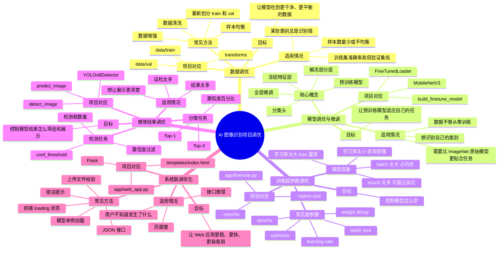
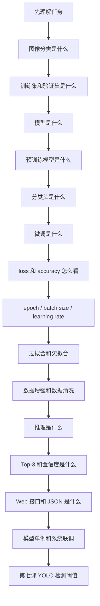

# AI 图像识别项目调优概念思维导图

> 适合给学生用来建立整体概念。建议先看第一张总图，再看第二张学习路径图。

---

## 一、总思维导图



---

## 二、学习路径图



---

## 三、调优分类对照表

| 调优类型 | 主要解决什么问题 | 典型手段 | 什么时候优先考虑 | 本项目对应位置 |
|---|---|---|---|---|
| 数据调优 | 数据质量不够好 | 清洗、增强、均衡、重划分 | 类别混乱、样本少、验证效果差 | `data/train`、`data/val`、`transforms.py` |
| 微调 | 预训练模型不认识你的类别 | 替换分类头、冻结层、解冻层 | 有自己的分类任务，但数据量不大 | `model_loader.py`、`finetune.py` |
| 超参数调优 | 训练过程不稳定或效果不好 | 调学习率、batch、epoch、优化器 | loss 乱跳、收敛慢、过拟合 | `finetune.py` 参数 |
| 推理调优 | 输出结果太多、太少或展示不合理 | Top-K、置信度阈值 | 模型已经训练好，但结果需要筛选 | `predict_image()`、`YOLOv8Detector` |
| 系统调优 | Web 应用慢、不稳、不友好 | 单例加载、错误处理、JSON、loading | 页面能跑但体验差或容易报错 | `web_app.py`、`index.html` |

---

## 四、学生最容易混淆的点

### 1. 参数和超参数不是一回事

```text
参数：模型自己学出来的权重。
超参数：人提前设置的训练配置。
```

例子：

```text
模型权重 = 参数
learning rate / batch size / epochs = 超参数
```

### 2. 微调不是普通调参数

微调不是简单改一个数字，而是：

```text
拿一个已经训练好的模型
换成自己的分类任务
再训练一小段
```

### 3. 数据调优通常比盲目换模型更重要

如果图片标错、类别不均衡、数据太少，换模型也可能没有明显提升。

### 4. 推理阈值不会改变模型本身

例如 YOLO 的 `conf_threshold`：

```text
阈值低：检测框更多，可能误检更多
阈值高：检测更严格，可能漏检
```

它只是筛选输出，不会重新训练模型。

### 5. 系统调优不是提高准确率，而是提高可用性

比如模型单例加载：

```text
不是让模型更准
而是让网页更快
```

---

## 五、一句话记忆版

```text
数据调优：让模型吃得更好。
微调：让预训练模型适应新任务。
超参数调优：让模型学得更稳。
推理调优：让结果展示更合理。
系统调优：让 Web 应用跑得更顺。
```

