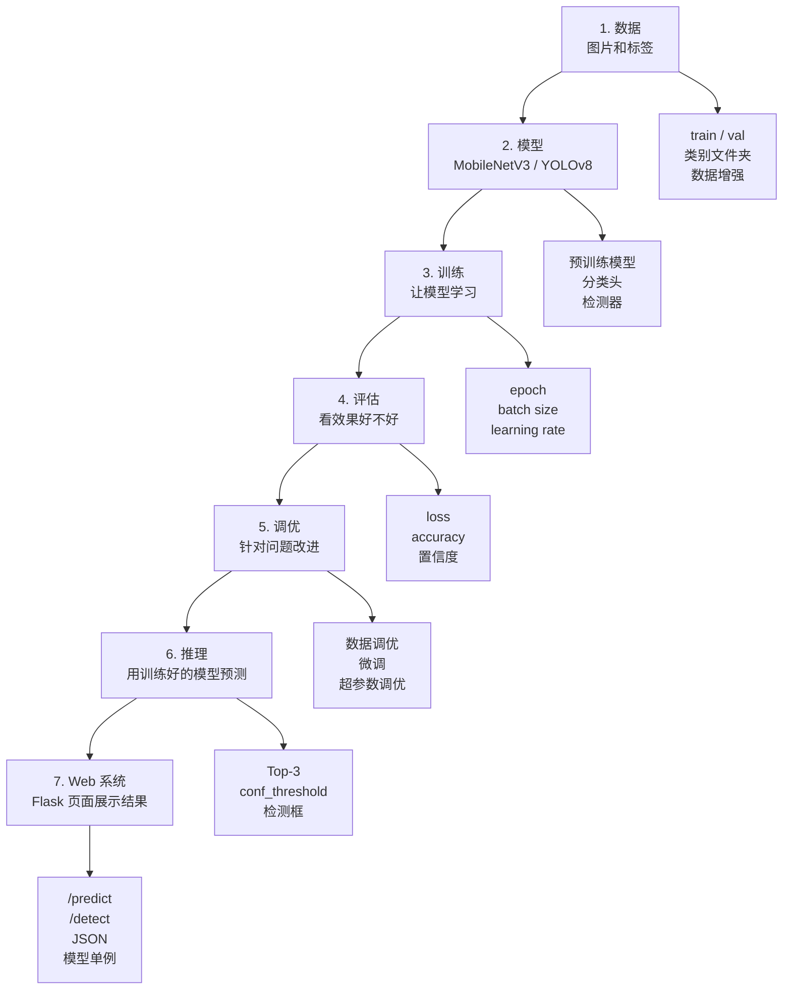
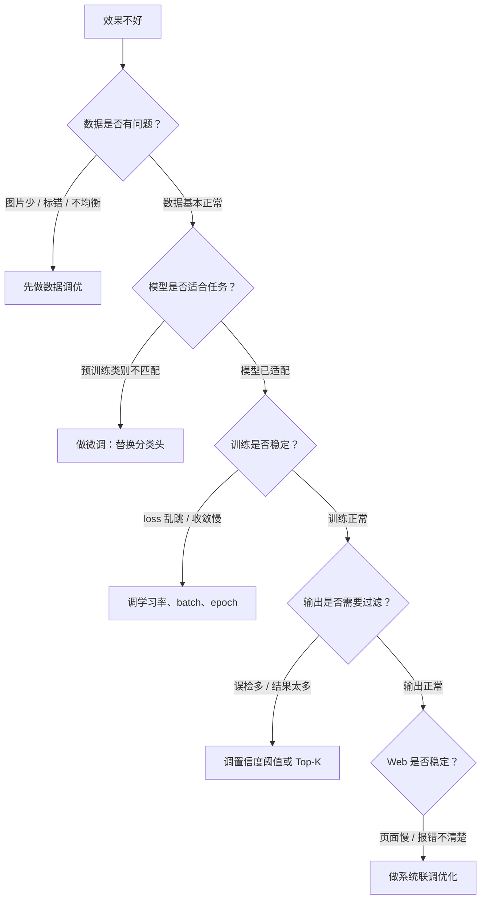

# AI 图像识别调优知识点关系图

> 这份不是发散式思维导图，而是按“先理解什么、再理解什么”的顺序整理。适合学生从上往下看。

---

## 一、总关系图：从数据到 Web 系统



这张图要表达的是：

```text
不是一上来就学“调优”。
要先知道数据、模型、训练、评估分别是什么。
调优是在发现问题之后，选择对应层面去改。
```

---

## 二、最推荐的学习顺序


学生如果觉得晕，就按这个顺序问自己：

```text
1. 我的数据放在哪里？
2. 模型原来会什么？
3. 我要让模型输出几个类别？
4. 我训练的是整个模型，还是只训练分类头？
5. 我训练了几轮？batch size 多大？学习率是多少？
6. loss 和 accuracy 表现怎么样？
7. 效果不好，到底应该改数据、改模型，还是改训练参数？
8. 模型预测结果怎么展示给用户？
```

---

## 三、调优到底分哪几层

```mermaid
flowchart TD
    Root["调优<br/>让系统效果更好或更稳定"] --> Data["A. 数据调优"]
    Root --> Model["B. 模型微调"]
    Root --> Train["C. 训练超参数调优"]
    Root --> Infer["D. 推理结果调优"]
    Root --> System["E. 系统联调优化"]

    Data --> DataWhy["解决：数据质量问题"]
    Data --> DataHow["做法：清洗、增强、均衡、重划分"]
    Data --> DataWhen["适用：样本少、类别不平衡、标注错"]

    Model --> ModelWhy["解决：模型不适应当前任务"]
    Model --> ModelHow["做法：换分类头、冻结层、解冻层"]
    Model --> ModelWhen["适用：用预训练模型做自己的分类"]

    Train --> TrainWhy["解决：训练过程不稳定"]
    Train --> TrainHow["做法：调 lr、batch、epoch、optimizer"]
    Train --> TrainWhen["适用：loss 震荡、收敛慢、过拟合"]

    Infer --> InferWhy["解决：输出结果展示不合理"]
    Infer --> InferHow["做法：Top-K、置信度阈值"]
    Infer --> InferWhen["适用：误检多、结果太多、想过滤"]

    System --> SystemWhy["解决：Web 系统慢或容易报错"]
    System --> SystemHow["做法：模型单例、错误处理、JSON"]
    System --> SystemWhen["适用：页面慢、接口不稳、用户看不懂错误"]
```



---

## 四、每一种调优和本项目的对应关系

| 调优层级 | 它在改什么 | 不在改什么 | 本项目例子 |
|---|---|---|---|
| 数据调优 | 改图片、标签、数据分布 | 不改模型结构 | `data/train`、`data/val`、数据增强 |
| 模型微调 | 改模型哪些层参与训练 | 不一定改学习率 | `build_finetune_model()`、替换分类头 |
| 超参数调优 | 改训练配置 | 不改数据本身 | `--epochs`、`--batch-size`、learning rate |
| 推理调优 | 改结果筛选和展示 | 不重新训练模型 | Top-3、YOLO `conf_threshold` |
| 系统调优 | 改 Web 运行流程 | 不提高模型本身准确率 | Flask、JSON、模型单例、错误提示 |

---

## 五、学生最容易搞混的关系

### 1. 微调 vs 超参数调优

```text
微调：决定训练模型的哪些部分。
超参数调优：决定训练时怎么学。
```

例子：

```text
冻结 features，只训练 classifier，这是微调策略。
把 batch size 从 16 改成 8，这是超参数调优。
```

---

### 2. 数据增强 vs 微调

```text
数据增强：改输入图片，让数据更多样。
微调：改模型训练过程，让模型适应任务。
```

例子：

```text
随机裁剪、翻转，是数据增强。
替换 MobileNetV3 的最后一层，是微调。
```

---

### 3. 训练调优 vs 推理调优

```text
训练调优：模型还在学习。
推理调优：模型已经训练好，只是在用它。
```

例子：

```text
修改 epochs 是训练调优。
修改 YOLO conf_threshold 是推理调优。
```

---

### 4. 模型准确率 vs 系统体验

```text
模型准确率：模型预测对不对。
系统体验：网页快不快、错了有没有提示、用户看不看得懂。
```

例子：

```text
换更好的训练数据，可能提高准确率。
模型只加载一次，主要提高网页速度。
```

---

## 六、遇到问题时怎么判断该调哪一层



---

## 七、最短记忆版

```text
先看数据，再看模型。
先让训练跑通，再谈效果。
效果不好，先定位是哪一层的问题。
不是所有问题都靠调学习率解决。
Web 慢，不一定是模型不准，可能是系统没做好单例加载。
```

